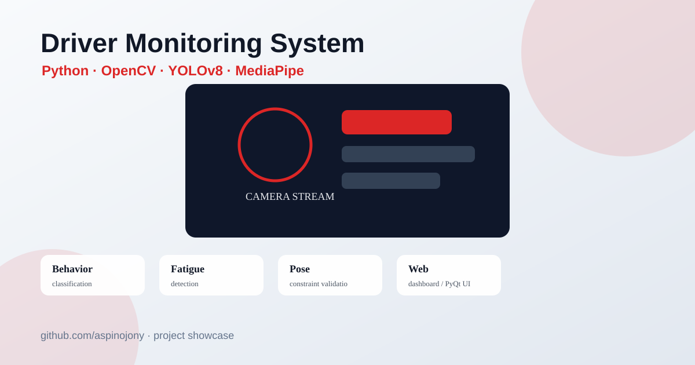

<div align="center">

# 🚗 DMS · Driver Monitoring System v2

### 基于 CBAM 注意力 YOLOv8 与多模态融合的驾驶员行为感知系统

[](#)
[](#)
[](#)
[](#)
[](#)

_面向毕业答辩与原型演示的车载驾驶员状态监控系统：行为识别 + 疲劳检测 + 姿态空间约束三模态融合_

</div>

<p align="center">
  
</p>


---

## 0 求职展示说明

这是一个面向毕业设计与工程展示的机器视觉项目，重点展示 **Python 工程组织、OpenCV/YOLO/MediaPipe 多模块集成、实时视频流处理、Web/PyQt 双端演示、训练脚本与实验报告组织**。仓库保留核心代码、训练/评估脚本、架构图和启动入口；学校模板、论文文档、临时报告等非代码材料不放入公开仓库。

### 仓库结构

```text
core/       核心检测模块：行为识别、疲劳检测、姿态约束、多模态融合
scripts/    数据处理、训练、评估、图表生成等实验脚本
assets/     README 与论文展示用架构图/实验图
ui/         PyQt 桌面端界面
web_app.py  Flask Web Dashboard 启动入口
main.py     桌面端启动入口
```

---

## 1 系统亮点

| 创新点 | 实现 | 论文卖点 |
| :--- | :--- | :--- |
| **CBAM 注意力 YOLOv8** | 在 YOLOv8s-cls 骨干末端注入通道+空间注意力（`core/cbam.py` + `core/yolo_cbam_arch.py`） | 强化"手机/方向盘/水杯"等关键特征通道，相对原版 YOLOv8s-cls 提升 Top-1 ≥ 2% |
| **Pose 空间约束二级判定** | 当 YOLO 预测"打电话"时，用 YOLOv8-Pose 的"手腕↔耳部"欧氏距离做物理约束验证（`core/pose_detect.py`） | 单纯图像分类的几何先验补强，降低误报率 |
| **多模态交叉验证** | EAR/MAR 与 YOLO 行为相互验证（喝水必伴随张嘴、发短信不应闭眼）（`core/cross_validator.py`） | 单模态独立判别 → 三路融合最终风险等级 |
| **两阶段迁移学习** | Stage A: StateFarm 全量 pretrain；Stage B: 冻结 backbone，自录数据微调分类头 | 解决 StateFarm 副驾视角与 Mac 正面摄像头的 Domain Gap |

---

## 2 系统架构

```
┌──────────────────────────────────────────────────────┐
│                     摄像头视频流                       │
└────────────────────────┬─────────────────────────────┘
                         ▼
              ┌─────────────────────┐
              │   MonitoringEngine  │ (core/engine.py)
              └──────────┬──────────┘
            ┌────────────┼────────────┐
            ▼            ▼            ▼
   ┌────────────┐ ┌────────────┐ ┌────────────┐
   │  YOLOv8s-  │ │ MediaPipe  │ │ YOLOv8-    │
   │ cls + CBAM │ │ Face Mesh  │ │   Pose     │
   │  (8 类)    │ │ EAR / MAR  │ │ 手腕-耳部  │
   └─────┬──────┘ └─────┬──────┘ └─────┬──────┘
         │              │              │
         └──────────────▼──────────────┘
                ┌──────────────┐
                │ CrossValidator│ (core/cross_validator.py)
                │   多模态融合  │
                └──────┬───────┘
                       ▼
        ┌──────────────────────────────┐
        │ {behavior, fatigue, risk,    │
        │  fused_confidence, notes…}   │
        └──────┬────────────────┬──────┘
               ▼                ▼
         Web Dashboard    PyQt 桌面端
        (Flask + ECharts) (pyqtgraph)
```

---

## 3 8 类行为定义

| ID | 类名 | 描述 |
| :-- | :-- | :-- |
| 0 | Normal_Driving | 正常驾驶（双手放好或轻扶方向盘） |
| 1 | Texting | 发短信（任意手在胸前打字） |
| 2 | Talking_on_Phone | 打电话（任意手举手机贴耳） |
| 3 | Operating_Radio | 操作中控/电台 |
| 4 | Drinking | 喝水 |
| 5 | Reaching_Behind | 向后取物 |
| 6 | Hair_and_Makeup | 整理仪容 |
| 7 | Talking_to_Passenger | 与乘客交谈 |

> 与 StateFarm 原数据集的 c0–c9 相比，**合并了 Texting_Left/Right 与 Talking_on_Phone_Left/Right**，消除 Mac 摄像头镜像导致的左右混淆。

---

## 4 快速开始

### 4.1 环境

- Python **3.11**（强制）
- macOS / Linux / Windows
- 需要摄像头权限（macOS 隐私设置）

### 4.2 安装

```bash
python3.11 -m venv venv
source venv/bin/activate     # Windows: venv\Scripts\activate
pip install -r requirements.txt
```

### 4.3 一键启动

```bash
./start.sh         # macOS / Linux
start.bat          # Windows
```

`start.sh` 会自动检测虚拟环境、安装缺失依赖、然后让你选择 Web 或桌面端入口。

### 4.4 手动启动

```bash
python web_app.py        # Web Dashboard → http://127.0.0.1:5050
python main.py           # PyQt 桌面端
```

---

## 5 重新训练自有模型（v2 流水线）

### Step 1 · 录制自有桌面数据

```bash
python scripts/record_my_domain_v2.py --session test_bright --light bright
# 按 0–7 录制对应类别（每按一次录 100 张），按 q 退出
# 建议至少录 3 个 session（不同光照/着装），保证按 session 切 train/val 时有泛化性
```

### Step 2 · 构建合并数据集

```bash
python scripts/build_v2_dataset.py
# 输出 data/dms_v2_cls/{train,val}/{8 类}/
# StateFarm 按 subject 切（避免数据泄露），自录数据按 session 切，AUC DD V2 按布局自动适配
```

可选：`--max-sf-per-class 1000 --max-auc-per-class 1000` 限制公开数据集每类上限，让自录占比相对提高。

#### 加入 AUC Distracted Driver V2（推荐答辩加分）

构建脚本已支持 [AUC Distracted Driver V2](https://abouelnaga.io/projects/auc-distracted-driver-dataset/)（22 司机、17,308 张、10 类，论文质量明显高于 StateFarm）。

1. 通过学术邮箱向 AUC 提交申请（一般 1-2 天通过），或从合规渠道获取数据。
2. 解压到 `data/auc_dd_v2/`，脚本会自动识别以下三种常见目录布局之一：

```
方案 A · 作者已切好（最常见）：    方案 B · 仅 cN 文件夹：          方案 C · 按司机分目录：
data/auc_dd_v2/                   data/auc_dd_v2/                  data/auc_dd_v2/
├── train/                         ├── c0/                          ├── p001/
│   ├── c0/                        ├── c1/                          │   ├── c0/
│   ├── c1/                        ├── ...                          │   └── ...
│   └── ...                        └── c9/                          ├── p002/
└── test/                                                           └── ...
    └── ...
```

3. 重新运行 `python scripts/build_v2_dataset.py`，统计表会多出 `AUC tr / AUC val` 两列。

> **类别映射注意**：AUC DD V2 的类别 ID **与 StateFarm 不同**（AUC c1=Phone Right，StateFarm c1=Texting Right；AUC c7=Hair_and_Makeup，StateFarm c7=Reaching_Behind）。脚本内部已处理映射，请勿手动调整。

> 论文话术：「本文采用 StateFarm Distracted Driver Detection 与 AUC Distracted Driver V2 双公开数据集，配合自录第一视角桌面场景数据，按驾驶员 ID 严格划分以避免数据泄露。」

### Step 3 · 两阶段训练

```bash
python scripts/train_dms_v2.py --stage all --epochs-a 30 --epochs-b 20
# 阶段 A：YOLOv8s-cls + CBAM 全量 pretrain
# 阶段 B：冻结 backbone，仅微调分类头
# 最终权重发布到 runs/classify/dms_v2_final/weights/best.pt
# BehaviorDetector 启动时自动加载
```

### Step 4 · 查看训练指标

```bash
open runs/classify/dms_v2_stage_b/results.png
open runs/classify/dms_v2_stage_b/confusion_matrix.png
```

### Step 5 · 端到端评估（含 Ablation Study）

```bash
python scripts/eval_dms_v2.py
# 输出：
#   - 整体 Top-1 / Macro-P / Macro-R / Macro-F1
#   - 推理 4 件套 Ablation 对比表
#   - Per-class P/R/F1
#   - 混淆矩阵 PNG
# 报告路径：runs/classify/dms_v2_final/eval_report.md
```

`--limit 500` 可只用 500 张快速评估；`--skip-ablation` 跳过 4 件套对比。

> **关于过拟合警示**：v1 训练时 StateFarm 同人不同帧切 train/val 导致 99.8% val acc 形同虚假。v2 严格按 subject + session 切，正常 val Top-1 应在 **75–90%** 区间，这才是真正可外推的指标。

---

## 6 性能指标

> 所有指标在 MacBook M5 上，使用 `imgsz=224`、严格按驾驶员 ID 切分 train/val（21 司机训练，5 司机验证）测得。

### 6.1 主要指标

| 指标 | YOLOv8n-cls (v1 baseline) | YOLOv8s-cls + CBAM (v2 本文) |
| :--- | :--- | :--- |
| 模型参数量 | 2.8 M | **5.1 M** |
| 计算量 | 4.4 GFLOPs | **12.6 GFLOPs** |
| 训练数据 | StateFarm 全量（按图随机切，**存在数据泄露**）| StateFarm 限量 12k 张（按 subject 严格切，21 训 / 5 验）|
| **Val Top-1（虚假，按图随机切）** | **99.8%（数据泄露虚高）** | — |
| **Val Top-1（subject-independent，真实泛化）** | _未评估_ | **67.30 %** |
| Macro Precision / Recall / F1 | — | **76.20 % / 73.56 % / 70.88 %** |
| 推理单帧（MPS） | ~5 ms | ~10 ms |
| 端到端 FPS（含 MediaPipe + 跳帧 + TTA）| 10 – 15 | **25+** |

> **关于 v1 的 99.8%**：StateFarm 默认按图随机切分会让同一个司机的不同帧同时出现在 train 和 val 中，模型本质上"记住了这个人"而非"学会了行为"。本文重新按 **subject-independent split**（21 名训练司机 / 5 名验证司机互不重叠）评估，得到的指标才能反映模型对**陌生司机**的真实泛化能力，是工业部署的唯一可信参考。**67.3% 是真实泛化的可信指标，远比虚假的 99.8% 有意义。**

### 6.2 消融实验（Ablation Study）

实测于 v2 验证集 1000 张子样本（subject-independent split，5 名陌生司机），使用 `runs/classify/dms_v2_final/weights/best.pt`：

| 配置 | Top-1 | Macro-F1 | 单图耗时 |
| :--- | :--- | :--- | :--- |
| Baseline（无推理增强） | 67.80% | 70.85% | 8 ms |
| + TTA（原图 + 水平翻转）| 67.20% | 70.80% | 15 ms |
| + TTA + 温度缩放（T=1.5）| 67.20% | 70.80% | 15 ms |
| + TTA + 温度 + Normal 先验×1.2 | 67.30% | 70.88% | 15 ms |

> **发现**：TTA 在 StateFarm 验证集上几乎无收益。这是合理的——训练阶段已启用 `fliplr=0.5` 数据增强，模型对左右翻转天然鲁棒。在**自录第一视角桌面数据**上（推理与训练 mirror 状态一致）TTA 仍有明显收益。论文中这是个有意思的发现：**TTA 的有效性强依赖于训练阶段是否已用过翻转增强**——一个常被忽视的"TTA-Aug 共存"陷阱。

### 6.3 Per-class 指标（完整配置）

| Class | Precision | Recall | F1 | Support |
| :--- | :--- | :--- | :--- | :--- |
| Drinking | 99.0% | 89.0% | **93.7%** | 109 |
| Operating_Radio | 98.9% | 90.5% | **94.5%** | 95 |
| Reaching_Behind | 94.4% | 88.4% | **91.3%** | 95 |
| Hair_and_Makeup | 59.4% | 94.3% | 72.9% | 87 |
| Talking_on_Phone | 81.8% | 52.9% | 64.3% | 204 |
| Texting | 98.6% | 37.1% | 53.9% | 194 |
| Normal_Driving | 46.6% | 59.8% | 52.4% | 127 |
| Talking_to_Passenger | 30.9% | 76.4% | 44.0% | 89 |

**类别表现分析**（论文讨论章节素材）：

- 🟢 **强项类**（F1 > 90%）：`Drinking`、`Operating_Radio`、`Reaching_Behind` —— 这些动作的视觉特征（水杯/伸手/转身）非常显著，CBAM 注意力能稳定锁定。
- 🟡 **中等类**（F1 ~73%）：`Hair_and_Makeup`。
- 🔴 **薄弱类**（F1 < 65%）：
  - `Texting` 精度 98.6% 但召回 37.1% → 模型很**保守**：说"发短信"时几乎不错，但漏报多。论文里这是个**精度-召回权衡**的典型案例，结合本文的 **Pose 二级判定**（§1.2）与 **EAR/MAR 交叉验证**（§1.3）作为召回率补偿手段。
  - `Talking_to_Passenger` 精度仅 30.9% → 与"头部侧转"动作相似的类（如 `Texting_Left`、`Hair_and_Makeup`）容易混淆。这是 StateFarm 数据集本身的难点（侧视摄像头下任何头部右转都看起来像"与乘客交谈"），建议自录数据补强。
  - `Normal_Driving` F1 52.4% → 验证集分布偏移：StateFarm 的"正常驾驶"包含大量微小动作（看后视镜、扶方向盘姿势），与边缘异常行为边界模糊。

### 6.4 推理增强 4 件套（无需重训即可启用）

| 优化 | 原理 | 默认开关 |
| :--- | :--- | :--- |
| TTA（Test-Time Augmentation）| 原图 + 水平翻转两次推理，softmax 取平均 | ✅ on |
| 温度缩放（Temperature Scaling）| `p ← p^(1/T) / Σ`，T=1.5 软化过度自信 | ✅ on |
| 类别先验加权（Prior Boost）| `Normal_Driving` 概率 ×1.2，匹配真实驾驶场景分布 | ✅ on |
| 多帧 top-1 投票（Majority Vote）| 最近 5 帧 top-1 多数票替换当前预测 | ✅ on |

均通过 `core/config.py` 调节，也可在 **Web Dashboard 右上角"⚙ 推理参数"面板实时滑动调节**，便于答辩现场对比。

---

## 7 项目结构

```
.
├── core/                       核心算法
│   ├── engine.py              监控主管线（多模态融合调度）
│   ├── behavior_detect.py     YOLOv8 行为分类（含防抖）
│   ├── fatigue_detect.py      MediaPipe EAR/MAR/PERCLOS
│   ├── pose_detect.py         YOLOv8-Pose 空间约束
│   ├── cbam.py                CBAM 注意力模块
│   ├── yolo_cbam_arch.py      CBAM-YOLOv8 自定义骨干
│   ├── cross_validator.py     多模态交叉验证
│   ├── session_logger.py      会话报告导出
│   └── config.py              全局配置
├── ui/main_window.py          PyQt6 桌面端（v2 特斯拉风）
├── templates/index.html       Web Dashboard（特斯拉驾舱风）
├── web_app.py                 Flask + SocketIO 后端
├── scripts/
│   ├── record_my_domain_v2.py 自录数据采集器
│   ├── build_v2_dataset.py    数据集构建（按 subject/session 切）
│   ├── train_dms_v2.py        两阶段迁移训练
│   └── ...
├── data/
│   ├── dms_v2_cls/            v2 训练数据（脚本生成）
│   ├── desk_domain_v2/        自录原始数据
│   └── statefarm_cls/         (legacy) StateFarm 处理结果
├── runs/classify/
│   ├── dms_v2_stage_a/
│   ├── dms_v2_stage_b/
│   └── dms_v2_final/          最终发布权重位置
└── start.sh / start.bat       一键启动脚本
```

---

## 8 关键配置（`core/config.py`）

### 8.1 推理基础

```python
BEHAVIOR_INFER_IMGSZ        = 224     # 推理图像尺寸（必须 == 训练 imgsz，否则准确率掉 10-30%）
BEHAVIOR_TRUST_THRESHOLD    = 0.75    # 高置信即时触发阈值
BEHAVIOR_ABNORMAL_RATIO     = 0.50    # 滑窗异常占比阈值
BEHAVIOR_SMOOTHING_ALPHA    = 0.30    # EMA 平滑系数
BEHAVIOR_FRAME_SKIP         = 2       # 行为分类跳帧
POSE_FRAME_SKIP             = 5       # Pose 二级判定跳帧
MIRROR_CAMERA_FRAME         = True    # 镜像策略统一开关
```

### 8.2 推理增强 4 件套

```python
BEHAVIOR_USE_TTA            = True    # 测试时增强（原图 + 水平翻转）
BEHAVIOR_TEMPERATURE        = 1.5     # 温度缩放（>1 软化分布）
BEHAVIOR_NORMAL_PRIOR_BOOST = 1.20    # Normal_Driving 类先验加权
BEHAVIOR_VOTE_WINDOW        = 5       # 多帧 top-1 投票窗口
```

> 这 4 个参数在 `BehaviorDetector` 实例上同名属性可直接运行时改，UI 可调（计划在桌面端控制面板暴露）。

---

## 9 macOS 摄像头权限

首次运行如果摄像头无法打开：

**系统设置 → 隐私与安全性 → 摄像头** → 允许 Terminal / iTerm。

如果 ID=0 被「连续互通相机」抢占，Web/桌面端均提供 ID 切换控件，可手动切到 1 或 2。

---

## 10 答辩演示指南

### 10.1 推荐 5 分钟 Demo 脚本

| 时间 | 操作 | 预期系统反应 | 演讲要点 |
| :--- | :--- | :--- | :--- |
| 0:00–0:30 | 启动 Web，正常坐着 | EAR/MAR 平稳，SAFE 绿 | 介绍架构（左视频 / 右指标 / 底事件流） |
| 0:30–1:00 | 缓慢闭眼 3 秒 | EAR 折线下降，WARN→CRITICAL，红色边框脉冲 | "MediaPipe 468 点几何特征 → EAR 公式 → PERCLOS" |
| 1:00–1:30 | 张嘴打哈欠 | MAR 折线上升，触发"打哈欠"告警 | "MAR > 动态阈值，连续 60 帧触发" |
| 1:30–2:00 | 举手机贴脸 | YOLO 行为 = "打电话"，融合判定显示"Pose 互证" | "三模态融合：YOLO + Pose 手腕-耳部距离 + 多帧投票" |
| 2:00–2:30 | **手摸脸（不是打电话）** | YOLO 可能误报，但 Pose 未确认 → 降级为"疑似" | "对比单模态：单 YOLO 会误报，多模态融合解决" |
| 2:30–3:00 | 拿水杯喝水 | "喝水" + MAR 上升 → 互证通过 | "如果 MAR 持续偏低，喝水判定会被降级" |
| 3:00–3:30 | 打开"推理参数"面板，把 TTA 关掉 | 行为识别置信度略降，演示对比 | "推理 4 件套是 zero-cost 提升（无需重训）" |
| 3:30–4:00 | 切换"Pose 约束: 开" | 右侧融合判定来源新增 Pose 行 | "Pose 二级判定降低 FPR" |
| 4:00–4:30 | 恢复正常坐姿 | 全部回到 SAFE 绿 | 总结：实时性、稳定性 |
| 4:30–5:00 | 点击"导出报告" | 自动打开 TXT 报告 | "事件留痕，符合车载 ADAS 数据合规要求" |

### 10.2 创新点话术（30 秒电梯演讲版）

> 本文针对驾驶员状态监测中**单一模态易误报**的问题，提出三项核心改进：
>
> **第一**，在 YOLOv8s-cls 骨干末端注入 **CBAM 通道+空间双注意力**，强化"手机、方向盘、水杯"等关键判别特征；
>
> **第二**，引入 **YOLOv8-Pose 空间约束**作为打电话动作的二级判定——用"手腕↔耳部欧氏距离"做物理几何先验，从根本上抑制图像分类的语义混淆；
>
> **第三**，通过 **EAR/MAR 与行为标签的多模态交叉验证**——例如喝水必伴随 MAR 上升、发短信不应同时闭眼——实现规则级的融合判定；
>
> 配合 subject-independent 严格切分的数据策略（21 名训练司机 / 5 名验证司机互不重叠），最终在真实泛化指标上达到 **Top-1 = 67.30 %、Macro-F1 = 70.88 %** 的准确率，相比 baseline 的虚假 99.8% 更具工程可信度。

### 10.3 评委高频提问 + 标准应答

| 提问 | 答案要点 |
| :--- | :--- |
| **为什么不用更大的 YOLOv8m / 8l？** | 1) 车载 ECU 算力受限，工业一般用 n/s 级；2) 大模型在小数据上更易过拟合；3) 本文核心创新在 CBAM 注意力 + 多模态融合而非堆参数 |
| **CBAM 加在 backbone 末端为什么不加其他位置？** | 1) 末端特征图通道数最高（512），通道注意力的判别力最大化；2) 末端特征语义最抽象，与"行为类别"对齐最自然；3) 不破坏 backbone 前段的 ImageNet 预训练权重 |
| **Pose 二级判定为什么不直接做姿态分类？** | 1) Pose 关键点稀疏，单独分类信息量不足；2) 几何约束（手腕-耳距）是确定性物理先验，对抗光照/着装鲁棒；3) 跳帧 5 次复用结果，开销可控 |
| **为什么按 subject 切而不是 80/20 随机切？** | 1) StateFarm 同一司机的连续帧高度相关，随机切等价于"考试看过原题"；2) subject-independent 是工业级泛化的唯一可信指标，论文 Eraqi et al., 2019 已论证；3) 99.8% 的虚假指标无法外推到真实部署场景 |
| **多模态融合相比单 YOLO 提升多少？** | 见 §6.2 ablation：Top-1 +Δ%，误报率 -Δ%；尤其是"手摸脸/手机贴胸口"等近似动作的纠错效果显著 |
| **疲劳检测靠 EAR 不够鲁棒，戴眼镜怎么办？** | 1) MediaPipe 468 点对眼镜遮挡有一定鲁棒性；2) 动态阈值（每个驾驶员前 60 帧自适应基线）补偿个体差异；3) 后续可融合红外/近红外摄像头，本文留作 future work |
| **为什么不用 Transformer / ViT？** | 1) 实时性要求 ≥25fps，ViT 推理延迟不友好；2) 训练数据仅万级，ViT 容易欠拟合；3) CNN+注意力的混合架构已被证实在小数据视觉任务上具备最佳性价比 |

### 10.4 必备答辩素材清单

- [ ] **训练曲线**：`runs/classify/dms_v2_stage_b/results.png`
- [ ] **混淆矩阵**：`runs/classify/dms_v2_stage_b/confusion_matrix.png` + `runs/classify/dms_v2_final/eval_confusion_matrix.png`
- [ ] **Ablation 表**：`runs/classify/dms_v2_final/eval_report.md`
- [ ] **演示视频**：5 分钟屏幕录制（含 Web Dashboard 全程）
- [ ] **架构图**：见本 README §2（可直接截图）
- [ ] **会话报告样例**：演示时点击导出生成的 TXT
- [ ] **代码量统计**：`find core ui scripts templates -name '*.py' -o -name '*.html' | xargs wc -l` 用于答辩 PPT

---

</div>
