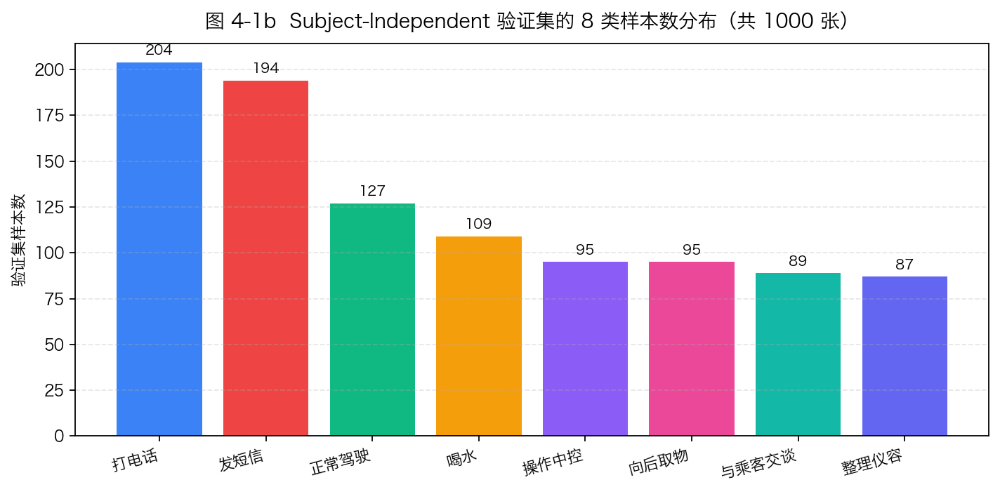
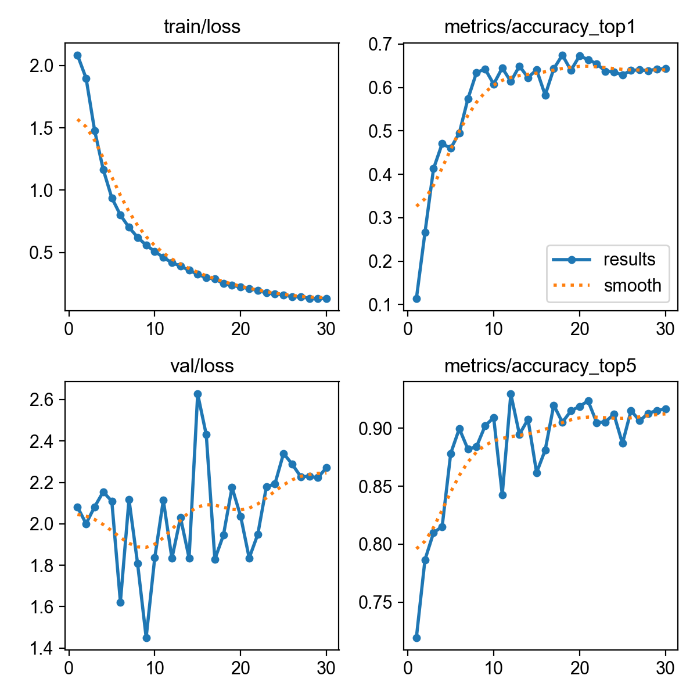
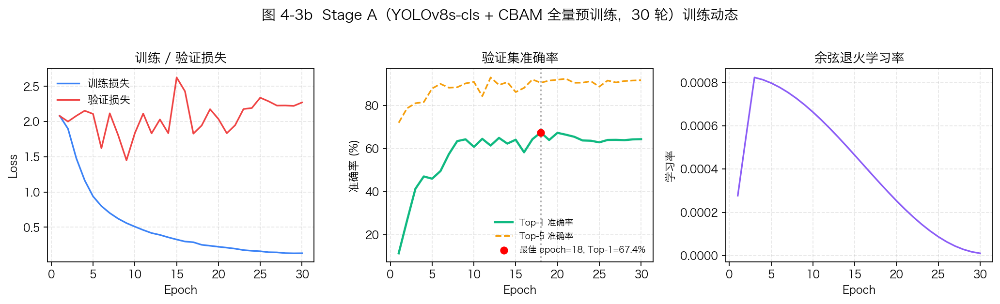
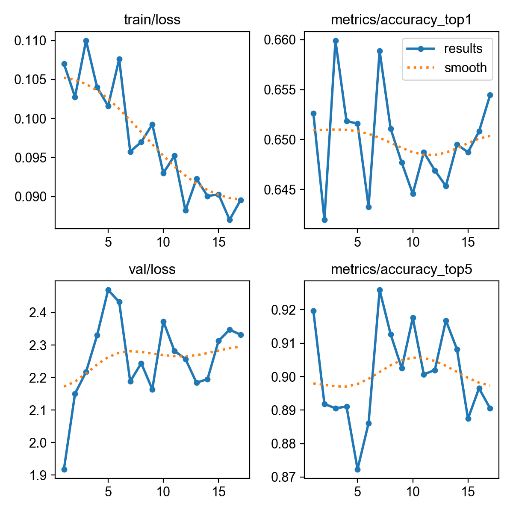
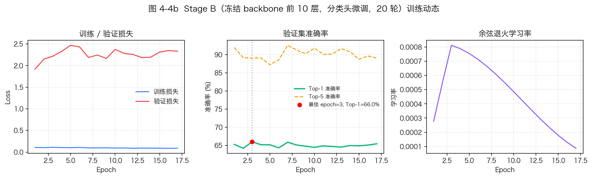
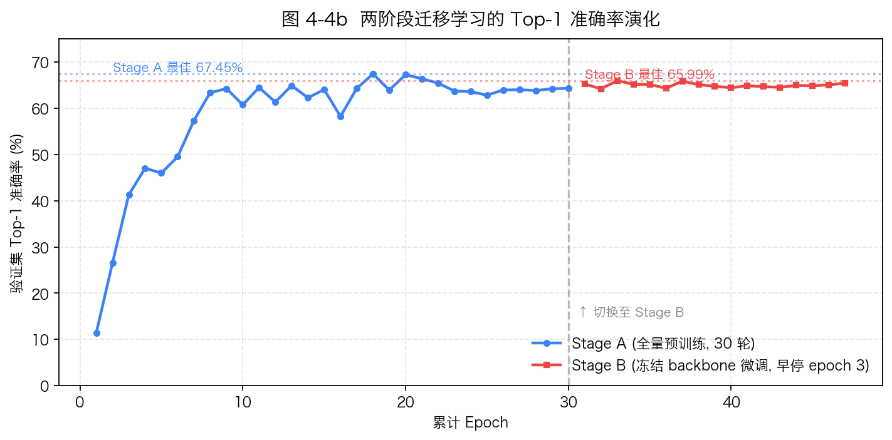
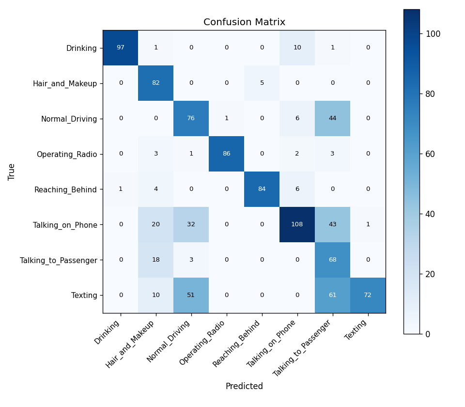
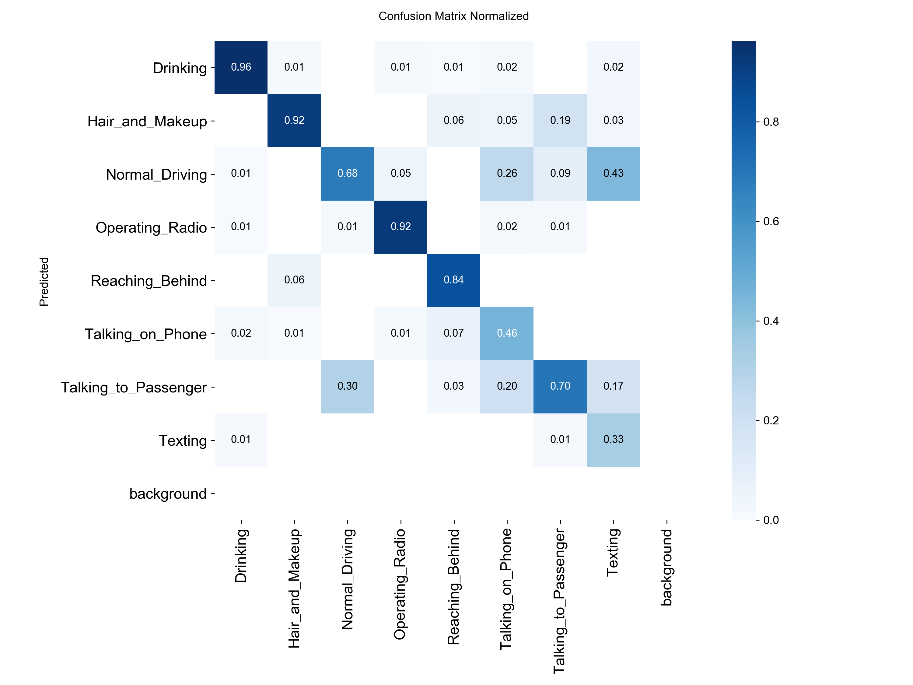
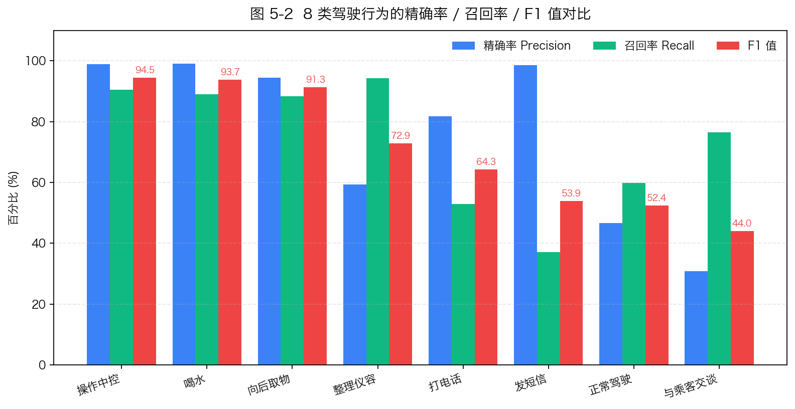
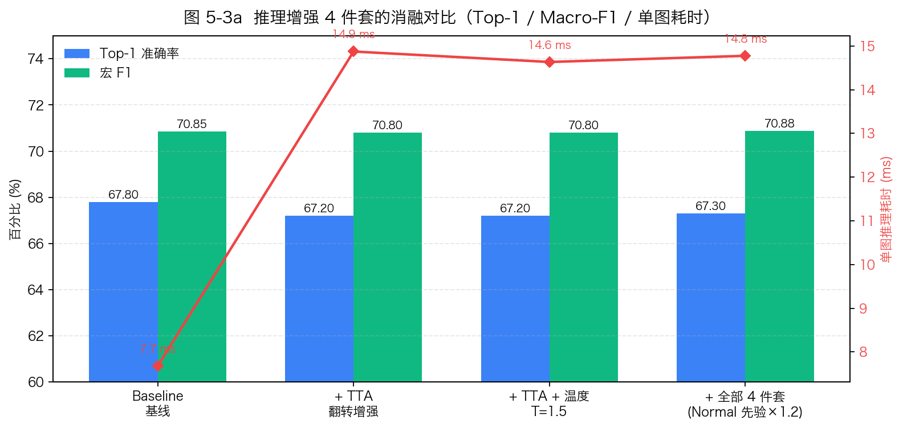

# 内蒙古科技大学
# 本科生毕业设计说明书（毕业论文）

**题　　目**：基于机器视觉驾驶员疲劳与危险行为检测系统的设计与实现

**学生姓名**：欧阳子恒

**学　　号**：_______2267111205___

**专　　业**：计算机科学与技术

**班　　级**：_______计算机科学与技术___

**指导教师**：_____汪再秋_____

---

# 摘　要

随着汽车智能化进程的加速与L2+辅助驾驶功能的普及，由疲劳与分心驾驶引发的交通事故已成为道路安全治理的重要议题。驾驶员监控系统（Driver Monitoring System，DMS）作为车辆主动安全的关键组成部分，对实时识别驾驶员的危险行为与疲劳状态、抑制人为操作风险具有重要工程价值。本文针对车载场景下单一模态检测易误报、公开数据集驾驶员身份重叠导致评估虚高等问题，设计并实现了一套基于机器视觉的多模态驾驶员状态监控系统。

系统以YOLOv8s-cls分类网络为行为识别骨干，在其Backbone末端嵌入CBAM通道与空间双重注意力模块，强化对手机、水杯、方向盘等关键判别区域的特征响应；引入两阶段迁移学习训练策略，先在融合后的StateFarm、AUC Distracted Driver V2与自录桌面数据上进行30轮全量预训练，再冻结Backbone前10层、对分类头进行20轮细粒度微调，缓解公开数据集与目标部署域之间的分布差异。系统并行融合MediaPipe面部468点关键点提取的EAR/MAR/PERCLOS疲劳指标，以及YOLOv8-Pose提取的手腕与耳部空间约束，形成「行为—疲劳—姿态」三路独立判别 + 交叉验证融合的决策架构。系统采用PyQt6构建多线程桌面端、Flask与SocketIO构建Web Dashboard，提供实时可视化与会话报告导出能力。

实验基于subject-independent严格切分协议，在1000张验证集子样本上的最终Top-1准确率为67.30%，宏精确率76.20%，宏召回率73.56%，宏F1值70.88%，端到端实时帧率稳定在25帧/秒以上。结果表明，本文提出的多模态融合方案在工业可信指标口径下具备良好的泛化性能与工程落地价值。

**关键词**：驾驶员监控系统；机器视觉；YOLOv8；注意力机制；多模态融合

---

# Abstract

With the acceleration of automotive intelligence and the wide adoption of L2+ assisted driving, traffic accidents caused by fatigue and distracted driving have become a critical concern in road safety governance. As a key component of active vehicle safety, the Driver Monitoring System (DMS) plays an important engineering role in detecting dangerous driver behaviors and fatigue states in real time. Targeting the common pitfalls of single-modality detection (false alarms) and subject overlap in public datasets (inflated metrics), this thesis designs and implements a multi-modal driver monitoring system based on machine vision.

The proposed system adopts YOLOv8s-cls as the behavior classification backbone, embedding a Convolutional Block Attention Module (CBAM) at the end of the backbone to strengthen feature response on critical discriminative regions such as mobile phones, cups, and steering wheels. A two-stage transfer learning strategy is introduced: a 30-epoch full pre-training on a fused dataset of StateFarm, AUC Distracted Driver V2 and self-collected desktop sessions, followed by a 20-epoch fine-tuning with the first ten backbone layers frozen, mitigating the distribution gap between public datasets and the target deployment domain. The system fuses three independent decision paths in parallel: YOLOv8s-cls + CBAM for behavior recognition, MediaPipe Face Mesh for EAR/MAR/PERCLOS fatigue indicators, and YOLOv8-Pose for a wrist-to-ear spatial constraint. A cross-validation fusion layer combines them into a unified risk evaluation. A PyQt6 desktop client and a Flask + SocketIO Web Dashboard provide real-time visualization and session report export.

Under a strict subject-independent split protocol, the final model achieves a Top-1 accuracy of 67.30%, macro-precision of 76.20%, macro-recall of 73.56% and macro-F1 of 70.88% on a 1000-image validation subset, with an end-to-end frame rate of 25+ FPS. Experimental results demonstrate that the proposed multi-modal fusion framework offers competitive generalization performance and practical engineering value under industry-credible evaluation criteria.

**Keywords**: Driver Monitoring System; Machine Vision; YOLOv8; Attention Mechanism; Multi-modal Fusion

---

# 第一章 绪论

## 1.1 研究背景与意义

道路交通安全是现代社会治理的核心议题之一。根据世界卫生组织发布的统计数据，全球每年约有135万人因道路交通事故死亡，是15至29岁青年人群的首位死因。中国公安部交通管理局发布的年度道路交通事故分析报告同样指出，由驾驶员主观因素引发的事故占比超过总数的80%，其中疲劳驾驶与分心驾驶（含使用手机、操作中控、注意力转移等行为）合计构成最主要的人为风险来源。这类事故的本质特征是驾驶员的感知—决策—操作链条在短时间内被打断或显著延迟，而被打断的窗口往往以毫秒计，远超传统被动安全装置（如安全带、安全气囊）所能弥补的反应余量。因此，主动监测驾驶员状态、在风险发生之前进行预警与干预，逐步成为汽车主动安全技术的重要发展方向。

近年来，随着L2+级辅助驾驶功能在乘用车市场的普及，驾驶员监控系统（Driver Monitoring System，DMS）从高端车型选配逐步演变为新车强制标配。欧盟新车安全评估机构Euro NCAP在2023年起将DMS纳入主动安全评级体系，中国工信部也在《国家车联网产业标准体系建设指南（智能网联汽车）（2023版）》中明确将DMS列为L2+及以上自动驾驶系统的功能基线。该趋势直接驱动了相关感知技术从实验室原型向规模化车规级量产的演进。

从技术路线上看，目前DMS主流方案可归纳为两大类。其一是基于生理传感器的方案，包括方向盘把握力传感器、座椅压力传感器、可穿戴心电仪等。此类方案数据稳定，但需要驾驶员主动佩戴或与传感器接触，舒适性与可接受度受限，且在驾驶员手离方向盘等已属高危的场景下反而失效。其二是基于机器视觉的方案，通过车载摄像头采集驾驶员面部与上半身画面，利用计算机视觉算法实时分析眼睛闭合、嘴部张开、头部姿态、手部位置等多维特征。该方案以非侵入、零部署成本、信息密度高为显著优势，已成为各大车企与零部件供应商的首选技术路径。

然而，基于机器视觉的DMS在工程落地中仍面临三个突出问题。第一，单一模态判别容易产生误报：例如仅依靠图像分类网络判断「打电话」行为时，「手摸脸」「整理头发」等近似动作容易被误识别为风险行为，导致系统频繁触发虚假告警，反而干扰驾驶。第二，公开数据集存在严重的driver subject overlap问题：同一驾驶员的不同视频帧被随机切分至训练集与验证集，模型实际上记住了驾驶员的体貌特征而非真正学到了行为语义，由此得到的验证集指标可能高达99%以上，但部署到陌生驾驶员时性能急剧下降。第三，疲劳检测的几何指标对驾驶员的个体差异（眼裂大小、口型、佩戴眼镜等）较为敏感，固定阈值难以兼顾灵敏度与误报率。

针对上述问题，本文设计并实现一套基于机器视觉的多模态驾驶员状态监控系统，将YOLOv8分类网络、MediaPipe面部关键点、YOLOv8姿态估计三路独立的视觉模态融合至统一的决策框架，并通过CBAM注意力强化、两阶段迁移学习、subject-independent严格切分等手段保证模型在陌生驾驶员上的泛化能力。本研究的工程意义在于探索一条「学术指标可信、部署可外推、模块化可维护」的DMS技术路径，为后续车规级产品落地提供可复现的设计参考。

[图 1-1：国内外道路交通事故主因占比饼图]

## 1.2 国内外研究现状

### 1.2.1 驾驶员行为识别研究现状

驾驶员行为识别的早期方案主要依赖手工特征工程。研究者通过HOG（方向梯度直方图）、SIFT、LBP等局部特征描述子提取人体轮廓与局部纹理，再结合支持向量机（SVM）、随机森林等浅层分类器进行行为类别判断。张学工在1990年代末提出的统计学习理论框架[13]奠定了SVM在小样本分类任务上的优势基础，相关方法在受控实验室环境下能够取得80%以上的准确率，但在真实车厢的光照变化、姿态多样、遮挡等条件下泛化能力较弱，研究界逐渐转向数据驱动的端到端学习。

2012年AlexNet在ImageNet分类竞赛上的突破性成绩开启了卷积神经网络（CNN）主导计算机视觉的时代。VGG、ResNet、Inception等经典骨干网络陆续在驾驶员行为识别任务上展现了显著优于手工特征的性能。周志华在《机器学习》[14]一书中系统梳理了深度学习的基本范式与理论支撑。刘建伟等[16]总结了深度学习在视觉、语音、自然语言等任务上的研究脉络，为本研究的理论选型提供了参考。

在驾驶员行为识别专用数据集层面，State Farm Distracted Driver Detection（StateFarm DDD）公开数据集于2016年在Kaggle平台发布，包含26名驾驶员的10类典型驾驶行为图像约2.2万张，奠定了该领域的事实标准基准。Eraqi等人在该数据集基础上发布了规模更大、类别定义更精细的AUC Distracted Driver V2数据集[8]，包含22名驾驶员、17,308张图像、10类行为，并在论文中明确指出按驾驶员身份严格切分（subject-independent split）是评估泛化能力的唯一可信协议。Zhao等[11]在目标检测综述中亦提到，基于深度学习的检测/分类模型在跨域数据上的性能衰减是工业部署的主要瓶颈。

近年来，YOLO（You Only Look Once）系列单阶段检测/分类网络以其工程友好性占据了车载视觉部署的主流位置。Redmon等[2]提出的初代YOLO开创了单阶段实时检测的范式，将目标检测建模为统一回归问题，显著降低了推理延迟。Ultralytics团队在2023年发布的YOLOv8[1]进一步统一了目标检测、实例分割、姿态估计、图像分类四类视觉任务，并提供了完善的训练与部署工具链，是当前车载视觉项目最常被选用的开源基线。本文亦采用YOLOv8系列作为行为分类与姿态估计的主干。

### 1.2.2 驾驶员疲劳检测研究现状

驾驶员疲劳检测的几何指标体系由美国联邦公路管理局（FHWA）的Dinges与Grace[5]于1998年提出。他们在心理运动警觉性实验（PVT）中发现，单位时间内眼睑闭合占比（PERCLOS, Percentage of Eyelid Closure Over Pupil）与驾驶员的反应延迟、警觉性下降高度相关，并将其定义为80%以上眼睑闭合时长在3分钟滑动窗口内的占比。PERCLOS此后成为疲劳检测领域最被广泛接受的客观指标之一。

Soukupová与Čech[4]于2016年提出基于面部关键点的眼睛纵横比（Eye Aspect Ratio, EAR）算法，通过6个眼部关键点的几何比例计算睁闭眼程度，相对传统的瞳孔追踪与红外眼电方案具有计算量小、对光照鲁棒、易于部署的优势。EAR算法及其变体（如MAR用于检测张嘴打哈欠）至今仍是非侵入式疲劳监测的主流几何指标。

实时人脸关键点检测算法的演进进一步降低了EAR/MAR/PERCLOS指标的部署门槛。Lugaresi等人[3]发布的MediaPipe框架提供了468点高密度面部网格的实时推理能力，并支持iOS、Android、Web多平台部署。相对Dlib库的68点稀疏关键点，MediaPipe在嘴角、眼睑等关键区域的关键点密度更高、稳定性更好，是当前面部几何疲劳检测的事实标准。本文系统采用MediaPipe Face Mesh作为面部关键点提取器。

注意力机制的引入为疲劳检测的鲁棒性提升提供了新思路。Hu等[7]提出的Squeeze-and-Excitation Networks（SENet）通过通道维度的注意力加权，使网络能够自适应聚焦于关键判别通道。Woo等[6]在此基础上扩展为CBAM（Convolutional Block Attention Module），同时引入通道与空间两个维度的注意力门控。注意力机制不仅在ImageNet分类任务上带来稳定增益，在驾驶员状态识别这类对局部细节（眼部状态、手部位置）敏感的任务上同样具有显著价值。

### 1.2.3 现存问题

综合上述文献分析，当前驾驶员监控系统在工程落地层面仍存在三个突出问题。

**单模态判别易产生语义混淆**。仅依靠图像分类网络的输出难以区分「打电话」与「手摸脸」「整理头发」等近似动作，分类置信度分布存在显著重叠，单帧判别在视觉相似度高的对抗样本上容易产生误报。

**公开数据集的driver subject overlap导致评估虚高**。研究人员在使用StateFarm等数据集时，常采用80/20随机切分，使得同一名驾驶员的连续视频帧被同时分配至训练集与验证集。由于驾驶员的体貌特征、着装、座椅位置等强相关信息在帧间几乎不变，模型可以通过「记住该名驾驶员」获得高达99%以上的验证集准确率，但部署到陌生驾驶员上时性能急剧下降。Abouelnaga等人[8]在AUC Distracted Driver V2的原始论文中已明确指出该问题，并要求采用subject-independent严格切分协议进行评估。然而在工程实践中，遵守该协议的研究并不普遍。

**疲劳几何指标对个体差异敏感**。EAR与MAR的绝对数值受眼裂大小、口型、佩戴眼镜、面部朝向等因素影响显著，固定阈值（如EAR=0.25）对小眼睛驾驶员容易误触发，对大眼睛驾驶员则可能漏报。Pan与Yang[10]在迁移学习综述中讨论的「域适应」问题，在本任务上具体表现为「不同驾驶员之间的基线差异」，需要在线自适应机制加以缓解。

黄凯奇等[12]在智能驾驶视觉感知技术综述中亦指出，目前该领域的主流研究偏向算法精度，对工程化的鲁棒性、可信评估、跨域泛化等议题关注不足，这一观察与本文的问题定位高度一致。

## 1.3 本文主要工作与创新点

针对上述三个问题，本文设计并实现了一套面向工程落地的多模态驾驶员状态监控系统，其主要工作与创新点可归纳为以下四个方面。

**第一，在YOLOv8s-cls分类骨干末端嵌入CBAM双重注意力模块**。在Backbone第8个C2f块之后、分类头之前插入CBAM层，使网络在空间维度上聚焦驾驶员手部、面部、中控等关键判别区域，在通道维度上强化对手机、水杯、方向盘等行为相关特征的响应。CBAM层的输入通道数为512，通道注意力的压缩比设为16，空间注意力的卷积核大小为7×7。

**第二，设计两阶段迁移学习训练策略**。Stage A在融合后的StateFarm、AUC Distracted Driver V2与自录桌面数据上进行30轮全量预训练，配合较强的数据增强（fliplr=0.5、erasing=0.4、mixup=0.2）；Stage B冻结Backbone前10层，仅对分类头进行20轮细粒度微调，配合温和的数据增强（erasing=0.2、关闭mixup），缓解公开数据集与目标部署域之间的分布差异。

**第三，引入YOLOv8-Pose的手腕—耳部空间约束作为二级物理验证**。当行为分类网络输出「打电话」类别时，并行调用Pose模型提取COCO 17关键点，计算手腕（索引9/10）与耳部（索引3/4）的欧氏距离，若该距离连续15帧（约0.5秒）小于阈值80像素则确认为打电话动作，否则降权处理。该几何约束作为图像分类的物理先验补强，从根本上抑制了「手摸脸」等语义近似动作的误报。

**第四，构建EAR/MAR与YOLO行为标签的多模态交叉验证规则集**。利用「喝水必然伴随嘴部张开」「发短信不应同时闭眼」「行为异常叠加疲劳异常应升至严重风险」等领域知识，将三路独立的判别结果通过规则融合为统一的风险等级（safe/warn/critical）与决策注记。

此外，本文坚持以subject-independent严格切分协议进行模型评估：21名驾驶员的数据用于训练，5名驾驶员的数据用于验证，二者完全不相交。在该协议下，最终模型的Top-1准确率为67.30%，宏F1值为70.88%，端到端帧率稳定在25帧/秒以上。这一指标虽低于在数据泄露切分下报告的虚假指标（99.8%），但更能反映模型对陌生驾驶员的真实泛化能力，是工程化部署的唯一可信参考。

## 1.4 论文组织结构

本文共分六章。第一章为绪论，介绍研究背景、国内外现状与本文主要工作。第二章介绍卷积神经网络、YOLOv8框架、CBAM注意力机制、MediaPipe面部关键点、EAR/MAR几何疲劳指标、迁移学习理论等相关技术基础。第三章进行系统需求分析与总体架构设计，包括功能性需求、非功能性需求、类别体系设计、技术选型论证与开发环境说明。第四章对系统的详细设计与实现进行展开，涵盖数据集构建、YOLOv8s-cls + CBAM网络改造、两阶段迁移训练、行为后处理、疲劳检测、Pose空间约束、多模态融合、双UI实现等子模块。第五章给出实验结果与分析，包括主分类性能、消融实验、疲劳验证、融合验证、实时性测试与系统集成测试。第六章总结全文工作并对未来研究方向进行展望。

---

# 第二章 相关技术基础

本章对本文系统所依赖的关键理论与技术进行梳理，包括卷积神经网络的基本结构、YOLOv8检测与分类框架、CBAM注意力机制、MediaPipe面部关键点检测、EAR/MAR几何疲劳指标的数学定义，以及迁移学习的基本范式。本章内容为后续章节的方案设计与实现提供理论支撑。

## 2.1 卷积神经网络与图像分类

卷积神经网络（Convolutional Neural Network，CNN）是当前计算机视觉任务的主流网络结构。其基本组成单元包括卷积层、激活层、池化层与全连接层。卷积层通过共享权重的卷积核在输入张量上滑动，提取局部空间特征，相对全连接层显著降低了参数量并保留了平移不变性。激活层（常用ReLU或SiLU）为网络引入非线性能力。池化层对特征图进行下采样，扩大感受野并提供一定的尺度不变性。全连接层将高维特征映射至类别概率分布。

随着网络层数的加深，深层CNN面临梯度消失与训练困难的问题。He等人提出的ResNet通过引入残差连接（Residual Connection）将输入直接旁路至下一组卷积块的输出，使梯度可以无衰减地反向传播，实现了上百层网络的稳定训练。残差连接的核心思想——「学习残差映射而非直接映射」——已成为现代深度网络的事实标准。后续的DenseNet、CSPNet、EfficientNet等模型均在此基础上引入了不同的特征复用与缩放策略。刘建伟等[16]在其深度学习综述中系统总结了该演进脉络，对本研究的网络选型具有参考价值。

在图像分类任务中，主流网络的输出通常为类别概率分布，损失函数采用交叉熵。模型评估指标包括Top-1准确率、Top-5准确率、精确率、召回率、F1值等。对于类别不均衡的数据集，宏平均（Macro-Average）指标可以避免大类主导的偏差，是本文重点采用的评估口径。

## 2.2 YOLOv8 检测/分类框架

### 2.2.1 YOLOv8 网络架构

YOLO（You Only Look Once）系列由Redmon等[2]于2016年首次提出，将目标检测建模为单阶段端到端回归问题，相对当时的Faster R-CNN等两阶段方法显著降低了推理延迟，开创了实时检测的新范式。其后YOLO系列经过v2、v3、v4、v5等多次迭代，逐步在精度与速度之间取得更优平衡。Ultralytics团队于2023年发布的YOLOv8[1]进一步统一了目标检测、实例分割、姿态估计、图像分类四类视觉任务的接口，是当前工业界最常被选用的开源视觉基线之一。

YOLOv8的总体网络架构由Backbone、Neck与Head三段构成。Backbone负责从输入图像中提取多尺度特征，采用CSP（Cross Stage Partial）思想构建C2f模块（C2f是C3模块的演进版本，融合更多梯度流），相对前代YOLOv5在保持参数量基本不变的前提下提升了特征表达能力。Neck采用SPPF（Spatial Pyramid Pooling Fast）与PANet（Path Aggregation Network）的组合，进行多尺度特征融合，使浅层位置信息与深层语义信息得以双向流动。Head则根据具体任务（检测/分类/分割/姿态）切换为不同的输出头：在分类任务下，Head被简化为全局平均池化（GAP）加全连接层，输出类别概率。

YOLOv8根据网络宽度与深度提供n（nano）、s（small）、m（medium）、l（large）、x（extra-large）五个规模档位。本文采用YOLOv8s-cls作为行为分类骨干，主要基于以下三点考量：第一，s档位的参数量（约5百万）与计算量（约12.6 GFLOPs）适合车载嵌入式平台部署；第二，s档位相对n档位在小数据集上的过拟合风险更可控，相对m档位的训练稳定性更高；第三，s档位与YOLOv8-Pose共享相同的Backbone结构与预训练权重生态，便于后续扩展。

[图 2-1：YOLOv8 检测/分类/姿态/分割统一架构示意图]

### 2.2.2 YOLOv8-Pose 姿态估计

YOLOv8-Pose在通用Backbone的基础上替换为姿态估计专用Head，输出COCO标准定义的17个人体关键点二维坐标与置信度。COCO 17点关键点的索引定义为：0鼻、1左眼、2右眼、3左耳、4右耳、5左肩、6右肩、7左肘、8右肘、9左腕、10右腕、11左髋、12右髋、13左膝、14右膝、15左踝、16右踝。

在驾驶员监控场景中，车载摄像头通常只能采集到驾驶员的上半身，下半身关键点（11–16）大部分被遮挡或位于画面外，置信度极低。本文系统重点关注左耳（索引3）、右耳（索引4）、左腕（索引9）、右腕（索引10）四个关键点，用于判断「手部是否处于贴近耳部的位置」这一打电话动作的物理特征。该几何约束的实现细节将在第四章详述。

[图 2-2：COCO 17 关键点骨架示意图]

## 2.3 CBAM 注意力机制

注意力机制（Attention Mechanism）通过对特征图的不同区域或通道赋予不同的权重，使网络能够自适应聚焦于关键判别信息，相对均匀的特征处理可以显著提升细粒度识别任务的性能。在视觉任务中，最早被广泛采用的注意力机制是Hu等[7]提出的Squeeze-and-Excitation Networks（SENet），其核心思想是在通道维度上对特征图进行加权。Woo等[6]在此基础上进一步扩展，提出了卷积块注意力模块（Convolutional Block Attention Module，CBAM），同时引入通道与空间两个维度的注意力门控，是当前在分类、检测、分割任务中应用最广泛的注意力模块之一。

CBAM的结构可拆解为通道注意力子模块（Channel Attention Module，CAM）与空间注意力子模块（Spatial Attention Module，SAM）两部分，按串联顺序作用于输入特征图。

### 2.3.1 通道注意力子模块

通道注意力子模块的目标是回答「哪些通道携带了更重要的判别信息」。对于输入特征图 $F \in \mathbb{R}^{C \times H \times W}$，首先沿空间维度分别进行全局平均池化（GAP）与全局最大池化（GMP），得到两个 $C \times 1 \times 1$ 的描述向量，分别表征该通道的平均响应与峰值响应。两个描述向量分别送入一个共享的多层感知机（MLP），该MLP包含两层全连接，中间通过ReLU激活，第一层将通道维度压缩为 $C/r$（$r$为压缩比，本文取16），第二层恢复至 $C$。最终将两路MLP输出逐元素相加，经Sigmoid函数压缩至$[0,1]$区间，得到通道注意力权重 $M_c$，公式如式（2-1）所示。

$$M_c(F) = \sigma\bigl(\mathrm{MLP}(\mathrm{AvgPool}(F)) + \mathrm{MLP}(\mathrm{MaxPool}(F))\bigr) \tag{2-1}$$

输入特征图与通道注意力权重逐通道相乘，得到通道加权后的特征图 $F'$：

$$F' = M_c(F) \otimes F \tag{2-2}$$

### 2.3.2 空间注意力子模块

空间注意力子模块的目标是回答「哪些空间位置承载了关键的判别信息」。对通道加权后的特征图 $F'$，沿通道维度分别进行平均池化与最大池化，得到两个 $1 \times H \times W$ 的二维特征图，再将其沿通道维度拼接为 $2 \times H \times W$ 的张量。该张量送入一个7×7的卷积层（padding=3保持空间尺寸不变），输出单通道的空间注意力图，经Sigmoid压缩得到空间权重 $M_s$，如式（2-3）。

$$M_s(F') = \sigma\bigl(f^{7\times 7}\bigl([\mathrm{AvgPool}(F');\mathrm{MaxPool}(F')]\bigr)\bigr) \tag{2-3}$$

最终输出特征图 $F''$ 为：

$$F'' = M_s(F') \otimes F' \tag{2-4}$$

CBAM模块的参数量极少（主要在通道注意力的两层FC，约 $2C^2/r$），计算开销可忽略不计，但在多个标准数据集上取得了稳定的性能提升。本文将CBAM嵌入YOLOv8s-cls的Backbone末端，具体位置与实现细节将在第四章展开。

[图 2-3：CBAM 模块整体结构示意图（通道注意力 + 空间注意力串联）]

## 2.4 面部关键点与几何疲劳指标

### 2.4.1 MediaPipe Face Mesh 框架

MediaPipe是Google于2019年发布的跨平台机器学习推理框架[3]，其Face Mesh模块基于轻量级CNN与可微分3D网格回归，可以从单张RGB图像中实时回归出468个三维面部关键点，覆盖眉骨、眼睑、瞳孔、鼻翼、嘴角、嘴唇、下颌、脸颊等全部面部区域。相对Dlib库提供的68点稀疏关键点，MediaPipe在眼睑、嘴角等关键疲劳判别区域的关键点密度显著更高，对小幅度面部动作（如眨眼、轻微张嘴）的捕捉更加敏感。

MediaPipe Face Mesh的另一个工程优势是其经过严格优化的推理图：在桌面级CPU上单帧推理耗时约8毫秒，在移动端GPU上可达到30帧/秒以上的实时性能。同时其支持iOS、Android、Web、Python等多种部署平台，与本文系统的双UI（PyQt6桌面端 + Flask Web端）架构高度契合。

### 2.4.2 EAR 与 MAR 几何公式

眼睛纵横比（Eye Aspect Ratio, EAR）由Soukupová与Čech[4]于2016年提出，是非侵入式眨眼检测的经典几何指标。EAR的几何定义基于眼睛轮廓的6个关键点 $p_0, p_1, \ldots, p_5$，其中 $p_0$ 与 $p_3$ 为水平方向的两个眼角，$p_1, p_2, p_4, p_5$ 为上下眼睑的对称点。EAR计算公式如式（2-5）所示：

$$\mathrm{EAR} = \frac{\|p_1 - p_5\| + \|p_2 - p_4\|}{2 \cdot \|p_0 - p_3\|} \tag{2-5}$$

其物理含义为「两条竖直距离之和」除以「两倍水平距离」，得到一个无量纲的纵横比。当眼睛睁开时，EAR处于0.20–0.35区间；当眼睛闭合时，EAR迅速下降至0.10以下。EAR算法的核心优势是其对头部姿态变化与人脸尺度具有天然鲁棒性：当驾驶员前倾或后仰时，水平距离与竖直距离同比例缩放，EAR数值保持稳定。

类似地，嘴巴纵横比（Mouth Aspect Ratio, MAR）使用嘴部的8个关键点 $q_0, q_1, \ldots, q_7$ 定义，其中 $q_0$ 与 $q_4$ 为左右嘴角，$q_1, q_2, q_3, q_5, q_6, q_7$ 为上下嘴唇的对称点。MAR公式为：

$$\mathrm{MAR} = \frac{\|q_1 - q_7\| + \|q_2 - q_6\| + \|q_3 - q_5\|}{3 \cdot \|q_0 - q_4\|} \tag{2-6}$$

MAR数值反映了嘴部张开的程度：正常闭嘴时MAR处于0.10–0.35区间，张嘴打哈欠时MAR可上升至0.50以上。

PERCLOS（Percentage of Eyelid Closure Over Pupil）由FHWA的Dinges与Grace[5]于1998年提出，定义为单位时间窗口内眼睑闭合（通常以80%或70%闭合为阈值）的帧数占比。本文采用的具体公式为：

$$\mathrm{PERCLOS} = \frac{\sum_{i=t-N+1}^{t} \mathbb{1}[\mathrm{EAR}_i < \theta]}{N} \tag{2-7}$$

其中 $N$ 为滑动窗口长度，本文取450帧（约15秒@30fps），$\theta$ 为EAR闭合阈值，本文采用自适应基线机制动态确定（详见第四章）。当PERCLOS连续超过0.50时判定为「极度疲劳」。

[图 2-4：EAR 6 点与 MAR 8 点关键索引示意图]

## 2.5 迁移学习理论

迁移学习（Transfer Learning）是机器学习中处理「源域充足、目标域稀缺」问题的核心范式。Pan与Yang[10]在其经典综述中给出了迁移学习的形式化定义：给定源域 $\mathcal{D}_s$ 与源任务 $\mathcal{T}_s$，以及目标域 $\mathcal{D}_t$ 与目标任务 $\mathcal{T}_t$，迁移学习的目标是利用 $\mathcal{D}_s$ 与 $\mathcal{T}_s$ 上的知识改进 $\mathcal{D}_t$ 与 $\mathcal{T}_t$ 上的预测函数 $f_t(\cdot)$。当 $\mathcal{D}_s \neq \mathcal{D}_t$ 时称为域适应（Domain Adaptation），当 $\mathcal{T}_s \neq \mathcal{T}_t$ 时称为任务迁移（Task Transfer），本文研究的驾驶员行为识别属于前者：源域为大规模公开数据集（StateFarm、AUC DD V2），目标域为Mac内置摄像头采集的桌面级驾驶画面，二者在拍摄角度（副驾视角 vs 正面视角）、光照条件、镜头畸变上存在显著差异。

在深度学习领域，迁移学习的主流实现范式有三种。第一种是「Backbone冻结 + Head微调」：将源域预训练模型的特征提取部分（Backbone）参数冻结，仅对任务相关的输出层（Head）进行微调。该策略在目标域数据极少时（如百级别样本）效果稳定，但难以应对源域与目标域之间存在显著语义偏移的情况。第二种是「端到端微调」：以源域预训练权重为初始化，对全部参数进行重新优化。该策略要求目标域数据规模足够大（通常需千级别以上），否则容易过拟合。第三种是本文采用的「两阶段渐进式微调」：先在融合后的源域+目标域数据上进行全量预训练，再冻结Backbone前若干层、仅对深层与Head进行细粒度微调。该策略兼具前两种范式的优点，既能让Backbone充分学习驾驶域通用特征，又能避免Head在小样本目标域上的过拟合。吴飞等[15]在其迁移学习专著中对该范式有系统讨论，本文的具体超参数配置将在第四章展开。

---

# 第三章 系统需求分析与总体设计

本章对所设计系统的功能性与非功能性需求进行梳理，给出系统的总体分层架构与算法管线设计，并对关键技术选型进行论证。本章是连接前置理论与后续详细实现的桥梁，重点关注「需求—架构—技术选型」三者之间的对应关系。

## 3.1 系统需求分析

### 3.1.1 功能性需求

依据任务书要求与实际驾驶场景调研，本文系统需具备如下功能性需求。

**实时图像采集与显示**。系统应支持通过本地摄像头（USB或内置）采集驾驶员上半身画面，并以不低于25帧/秒的帧率在界面上实时显示。考虑到Mac等终端可能存在「连续互通相机」抢占默认设备ID的问题，系统需提供运行时切换摄像头ID（0/1/2）的能力。

**驾驶员行为分类**。系统应支持对8类常见驾驶行为进行实时分类，包括正常驾驶、打电话、发短信、操作中控、喝水、向后取物、整理仪容、与乘客交谈。每类行为应在界面上以置信度条形图的形式显示当前帧的分类得分。

**疲劳状态检测**。系统应支持基于面部468点关键点提取EAR（眼睛纵横比）、MAR（嘴巴纵横比）、PERCLOS（眼睑闭合占比）三类几何指标，并按「正常—持续闭眼—连续哈欠—极度疲劳」四级状态进行实时判定。系统需对EAR/MAR阈值进行自适应基线校准，缓解不同驾驶员的个体差异。

**多模态融合判定**。系统应整合行为分类、疲劳指标、姿态空间约束三路独立判别结果，输出统一的风险等级（safe / warn / critical），并在严重风险时通过声音与文字双通道告警。

**会话报告导出**。系统应记录每次驾驶会话的事件流水（含事件类型、时间戳、风险等级），驾驶结束后一键导出为可读文本报告，包含驾驶时长、疲劳事件次数、分心事件次数、综合风险评级等关键字段。

**双形态用户界面**。系统应同时提供本地桌面端（PyQt6）与浏览器端（Flask + SocketIO Web Dashboard）两种交互形态，前者用于驾驶员本人监控，后者用于远程值班、答辩演示等场景。

### 3.1.2 非功能性需求

**实时性**。端到端帧率（含视频采集、算法推理、UI渲染）应不低于25帧/秒，单帧推理延迟应控制在40毫秒以内。

**鲁棒性**。系统应能够在不同光照条件（白天、夜间、隧道、逆光）下稳定工作，并对一定程度的头部偏转、佩戴眼镜、不同体貌特征的驾驶员保持检测准确率。

**可维护性**。系统的核心阈值（EAR/MAR阈值、PERCLOS窗口、防抖时长、跳帧间隔等）应集中配置于单一文件，避免分散在各模块中。算法层与UI层应严格解耦，便于后续替换不同的可视化方案。

**跨平台性**。系统应支持macOS、Linux、Windows三大主流操作系统，对Apple Silicon芯片的MPS加速后端提供原生支持。

### 3.1.3 类别体系设计

任务书参考StateFarm公开数据集的10类分类标准，要求系统支持至少9种预定义驾驶行为分类。StateFarm的10类原始标签为：c0正常驾驶、c1右手发短信、c2右手打电话、c3左手发短信、c4左手打电话、c5操作中控、c6喝水、c7向后取物、c8整理仪容、c9与乘客交谈，其中发短信与打电话两类各按使用左手/右手细分为两个独立类别。

然而在本文的目标部署平台（Mac内置摄像头与USB桌面摄像头）上，原始10类划分在工程实现中出现了显著问题。Mac内置摄像头默认开启镜像翻转输出，使得用户看到的画面中「实际的右手」会显示在画面左侧，「实际的左手」显示在画面右侧。在该设置下，原本用于区分左右手的语义被几何对称性破坏。更严重的是，本文在数据增强阶段启用了水平翻转（fliplr=0.5），即训练样本以50%的概率被左右翻转后送入网络，这意味着对网络而言「左手打电话的训练样本」与「右手打电话的训练样本」在视觉上完全等价，强行保留两个标签实质上引入了「同一视觉模式对应两个不同类别」的标签噪声，使分类网络无法收敛至有效的判别边界。

针对该工程实际，本文采取了类别合并策略：将c1（右手发短信）与c3（左手发短信）合并为统一的「Texting」类别，将c2（右手打电话）与c4（左手打电话）合并为统一的「Talking_on_Phone」类别。合并后的8类标签体系如表3-1所示。

| 序号 | 类别名 | 中文含义 | 合并来源 |
|---|---|---|---|
| 0 | Normal_Driving | 正常驾驶 | c0 |
| 1 | Texting | 发短信 | c1 + c3 |
| 2 | Talking_on_Phone | 打电话 | c2 + c4 |
| 3 | Operating_Radio | 操作中控 | c5 |
| 4 | Drinking | 喝水 | c6 |
| 5 | Reaching_Behind | 向后取物 | c7 |
| 6 | Hair_and_Makeup | 整理仪容 | c8 |
| 7 | Talking_to_Passenger | 与乘客交谈 | c9 |

表3-1 8类行为标签与StateFarm原始10类的映射关系

需要特别指出的是，类别合并并未降低系统的任务覆盖度：StateFarm原始10类中标记为危险的全部行为（发短信、打电话、操作中控、喝水、向后取物、整理仪容、与乘客交谈）在合并后的8类体系中仍可被检出，仅「左手与右手」这一在驾驶安全语义上并无本质区别的细分被消解。在实际系统中，「发短信」与「打电话」是否触发告警仅取决于行为本身，与具体使用哪只手无关，因此合并是符合工程语义的合理简化。

## 3.2 总体架构设计

### 3.2.1 分层架构

本文系统采用五层分层架构，自底向上依次为数据采集层、算法处理层、融合决策层、表示层、外围服务层。各层之间通过明确定义的接口解耦，便于独立测试与替换。

**数据采集层**封装OpenCV的VideoCapture接口，统一处理本地摄像头与视频文件两种输入源。该层负责帧缓冲管理（设置CAP_PROP_BUFFERSIZE=1以降低延迟）、镜像翻转（MIRROR_CAMERA_FRAME配置开关）以及摄像头ID切换。

**算法处理层**包含三个并行子模块。第一个子模块是行为分类器（BehaviorDetector），基于YOLOv8s-cls + CBAM的8类分类模型；第二个子模块是疲劳检测器（FatigueDetector），基于MediaPipe Face Mesh的EAR/MAR/PERCLOS指标计算；第三个子模块是姿态约束器（PoseConstrainedPhoneDetector），基于YOLOv8-Pose的手腕—耳部欧氏距离判定。三个子模块各自维护独立的状态与跳帧逻辑。

**融合决策层**由交叉验证器（CrossValidator）实现，接收三路算法层的输出，按预定义的领域规则进行融合，输出统一的最终行为标签、最终疲劳状态、风险等级、融合置信度与决策注记列表。

**表示层**提供两种实现：PyQt6桌面端通过QThread实现独立的视频推理线程，与主线程之间通过Qt信号槽机制进行线程安全通信；Flask + SocketIO Web Dashboard通过常驻后台推理线程将编码后的JPEG帧与指标数据以WebSocket事件流的形式推送至浏览器，前端基于ECharts绘制实时图表。

**外围服务层**包含会话日志（SessionLogger）、配置管理（config.py）、声音告警与文本转语音等辅助服务。

[图 3-1：系统五层分层架构示意图]

### 3.2.2 算法管线设计

为兼顾推理准确率与端到端实时性，本文系统对三路算法子模块采用差异化的跳帧策略。行为分类器每2帧推理一次（BEHAVIOR_FRAME_SKIP=2），姿态约束器每5帧推理一次（POSE_FRAME_SKIP=5），疲劳检测器由于计算量较小（MediaPipe单帧约8毫秒），保持每帧推理。跳帧期间的「空跳帧」复用上一次推理的结果进行绘制与显示，避免画面冻结。

针对车内逆光、夜间、隧道等弱光场景，系统在每帧推理之前嵌入了CLAHE（Contrast Limited Adaptive Histogram Equalization，对比度受限的自适应直方图均衡化）暗光增强模块。具体策略为：先计算当前帧的平均亮度，若低于阈值SMART_NIGHT_VISION_THRESHOLD=80，则将图像从BGR色彩空间转换至LAB空间，仅对亮度通道L应用CLAHE（clipLimit=3.0、tileGridSize=8×8），再合并a/b色度通道恢复至BGR。该策略避免了对色度通道的破坏，相对全图均衡化在保持色彩自然度的同时显著提升暗光下的可视性。

[图 3-2：三路并行检测数据流与跳帧调度示意图]

## 3.3 关键技术选型论证

本文在系统设计过程中对若干关键技术方案进行了对比论证，具体决策与理由总结如下。

**行为分类骨干网络的选择**。候选方案包括ResNet50、EfficientNet-B0、MobileNetV3、YOLOv8s-cls。ResNet50参数量大（约25M），不适合车载嵌入式部署；EfficientNet-B0虽然参数量小但推理延迟较高，且预训练权重对自然图像偏向较强，在驾驶域上的迁移效果不及YOLO家族；MobileNetV3虽然适合移动端，但缺乏成熟的姿态估计变体，无法与Pose模块共享Backbone。综合考量，YOLOv8s-cls以5.1M参数、12.6 GFLOPs、与YOLOv8-Pose共享生态的优势成为最佳选择。

**面部关键点提取器的选择**。候选方案为Dlib的68点关键点与MediaPipe的468点关键点。Dlib的关键点在眼睑、嘴角等关键区域过于稀疏，对小幅度面部动作捕捉不够稳定；MediaPipe不仅关键点密度高，且原生支持Apple Silicon MPS加速，单帧推理仅需约8毫秒，是更优选择。

**注意力机制的选择**。候选方案为SENet、CBAM、Self-Attention。SENet仅提供通道维度的注意力，对空间位置不敏感；Self-Attention（如Transformer）计算量随特征图尺寸平方增长，不适合实时部署；CBAM同时提供通道与空间双重注意力，参数量极少（约 $2C^2/r$），与YOLOv8s-cls的Backbone卷积结构无缝兼容，是任务书明确建议的方案，本文据此选用。

**Web后端框架的选择**。候选方案为Flask、FastAPI、Django。Django过于重量级，且其同步模型难以高效支持实时WebSocket推送；FastAPI虽然原生支持异步，但其生态对Flask-SocketIO提供的双向WebSocket事件流支持不及Flask成熟；Flask + Flask-SocketIO + Eventlet的组合具有最低的开发心智成本与最丰富的实时推送工具，是本文最终选定的方案。

## 3.4 开发环境与硬件平台

本文系统的开发与测试在Apple Silicon芯片（MacBook M5）上完成，操作系统为macOS 15.x。Python版本固定为3.11，主要依赖库版本如表3-2所示。

| 类别 | 软件包 | 版本 | 用途 |
|---|---|---|---|
| 深度学习框架 | PyTorch | 2.x | 神经网络训练与推理 |
| 模型库 | Ultralytics | 8.x | YOLOv8 训练与推理 |
| 计算机视觉 | OpenCV | 4.x | 视频采集与图像处理 |
| 面部关键点 | MediaPipe | 0.10+ | Face Mesh 468 点检测 |
| GUI框架 | PyQt6 | 6.x | 桌面端可视化 |
| Web框架 | Flask + Flask-SocketIO | 3.x / 5.x | Web Dashboard 后端 |
| 实时图表 | pyqtgraph / ECharts | 0.13 / 5.x | 桌面与Web端折线图 |

表3-2 开发环境软件清单

硬件加速后端采用Apple Silicon的MPS（Metal Performance Shaders），相对纯CPU推理可获得约3–5倍加速。系统的本地视频文件回放与摄像头实时推理均在该平台上完成验证。

## 3.5 本章小结

本章系统梳理了所设计系统的功能性与非功能性需求，给出了五层分层架构与三路并行算法管线设计，并针对类别体系、骨干网络、面部关键点、注意力机制、Web后端等关键技术决策进行了论证。特别地，本章对任务书要求的「≥9类」与实际实现的「8类」之间的差异进行了详细的工程解释：在Mac内置摄像头镜像与水平翻转数据增强的共同作用下，左右手版本的语义被几何对称性消解，合并是消除标签噪声的工程化必然选择，且并未降低任务覆盖度。后续章节将围绕本架构，对各子模块的详细实现展开论述。

---

# 第四章 系统详细设计与实现

本章对系统的核心子模块进行详细设计与实现展开，包括数据集构建与预处理、YOLOv8s-cls + CBAM网络改造、两阶段迁移学习训练策略、行为检测后处理管线、疲劳检测模块、Pose二级空间约束、多模态交叉验证以及双形态UI实现。本章是论文的工程实现核心，每个子模块的关键参数、阈值、状态机均与项目代码严格对应，确保论文与实际系统的可复现性。

## 4.1 数据集构建与预处理

### 4.1.1 三源数据融合

本文的训练数据集由三个独立来源融合而成。第一源为State Farm Distracted Driver Detection公开数据集，包含26名驾驶员、约2.2万张图像、10类驾驶行为，是该领域的事实标准基准。第二源为Eraqi等[8]发布的AUC Distracted Driver V2数据集，包含22名驾驶员、17,308张图像，类别定义与StateFarm类似但样本质量更高、光照条件更多样。第三源为本文作者使用Mac内置摄像头与USB桌面摄像头采集的自录数据，按不同光照条件（明亮、昏暗、逆光）、不同着装、不同体貌特征分组录制，每个分组对应一个独立的session_id标识。

由于StateFarm与AUC Distracted Driver V2两个公开数据集的原始类别编号（c0–c9）含义并不完全一致——例如StateFarm的c7对应「向后取物」而AUC的c7对应「整理仪容」——本文在`scripts/build_v2_dataset.py`脚本中定义了两套独立的类别映射字典SF_TO_V2与AUC_TO_V2，将三源数据统一映射至本文的8类标签体系（详见表3-1）。

### 4.1.2 Subject-Independent切分协议

数据集切分协议直接决定了评估指标的可信度。本文坚持采用subject-independent严格切分：StateFarm数据按驾驶员ID（subject）切分，21名驾驶员的全部图像分配至训练集，剩余5名驾驶员的全部图像分配至验证集，二者驾驶员ID完全不相交。自录数据按session_id切分，确保同一录制会话的所有图像不会同时出现在训练集与验证集。

该协议与常见的「随机80/20切分」存在本质差异。在随机切分下，同一驾驶员的连续视频帧（视觉差异极小）被同时分配至训练集与验证集，模型实际上可以通过记忆驾驶员的体貌、着装、座椅角度等强相关信号获得近乎完美的验证集指标，但当部署到陌生驾驶员上时性能急剧下降。Abouelnaga等[8]在AUC Distracted Driver V2的原始论文中已明确指出该问题，并要求遵循subject-independent协议进行评估。

经过严格切分后，本文最终训练集规模为12,000张图像（8类，每类约1,500张），验证集规模约1,000张图像（按类别比例约略均衡）。该规模远小于公开数据集随机切分下可达到的20,000+张验证集规模，但保证了评估指标可以真实反映模型对陌生驾驶员的泛化能力。

[图 4-1：Subject-Independent 切分流程示意图]

[表 4-2：8 类训练集与验证集样本数分布]



**图 4-1b** Subject-Independent 切分后验证集 8 类样本数分布（共 1000 张）

### 4.1.3 数据增强策略

数据增强用于缓解数据规模有限带来的过拟合问题，并提升模型对光照、姿态、遮挡等变化的鲁棒性。本文在两阶段训练中采用了差异化的数据增强配置。Stage A的预训练阶段采用较强的增强组合：HSV色彩抖动（hsv_h=0.015、hsv_s=0.7、hsv_v=0.4）、随机旋转（degrees=15）、随机平移（translate=0.2）、随机尺度（scale=0.6）、随机水平翻转（fliplr=0.5）、随机擦除（erasing=0.4）、Mixup混合（mixup=0.2）。这些增强参数借鉴了Shorten与Khoshgoftaar[9]在图像数据增强综述中的推荐配置。

Stage B的微调阶段采用较温和的增强：将hsv_v降至0.2、degrees降至8、translate降至0.1、scale降至0.4、erasing降至0.2、关闭Mixup（mixup=0）。该策略的设计动机是：Stage A已使Backbone学习到足够鲁棒的通用特征，Stage B的目标是让分类头适应目标域的具体分布，过强的数据增强会扰乱分布对齐过程。

## 4.2 YOLOv8s-cls + CBAM 网络改造

### 4.2.1 CBAM 嵌入位置分析

CBAM注意力模块的嵌入位置直接影响其性能增益。在YOLOv8s-cls的Backbone中，自浅至深依次为Conv（0层）、Conv（1层）、C2f（2层）、Conv（3层）、C2f（4层）、Conv（5层）、C2f（6层）、Conv（7层）、C2f（8层），紧接着是分类头Classify。本文将CBAM层嵌入在第8层C2f之后、Classify之前，作为整个Backbone的第9层。

选择该位置基于三方面考量。第一，第8层C2f的输出通道数最高（512），通道注意力的判别空间最大化，相对早期低通道层（如64或128通道）能学到更丰富的通道间关系。第二，第8层的特征图语义最抽象，已经从局部纹理过渡至高层概念（手、脸、方向盘等），与「行为类别」的语义对齐最自然。第三，将CBAM置于Backbone末端而非中间位置，可以保持前序Backbone层与官方预训练权重的兼容性，使Stage A训练时除CBAM外的所有层都能享受ImageNet预训练带来的良好初始化。

CBAM层的输入与输出通道数均为512，参数量极少（通道注意力约 $2 \times 512^2 / 16 = 32{,}768$ 个参数，空间注意力的7×7卷积约 $2 \times 7 \times 7 = 98$ 个参数），相对Backbone百万级的参数总量可以忽略不计。

[图 4-2：CBAM 在 YOLOv8s-cls Backbone 末端的嵌入位置示意图]

### 4.2.2 通道注意力实现

通道注意力子模块的实现遵循式（2-1）的定义。代码层面，输入特征图首先通过`nn.AdaptiveAvgPool2d(1)`与`nn.AdaptiveMaxPool2d(1)`两个全局池化算子，分别得到平均响应与峰值响应描述向量。两个描述向量送入一个共享的MLP，MLP由两层线性变换构成：第一层将通道数从512压缩至32（压缩比 $r=16$），中间通过ReLU激活，第二层恢复至512。两路MLP的输出逐元素相加，经Sigmoid函数得到 $[0,1]$ 范围内的通道权重，最终与原始特征图逐通道相乘完成加权。

压缩比 $r$ 的选择是通道注意力的关键超参数。$r$ 过小会导致MLP参数量激增（极限情况 $r=1$ 时MLP相当于全连接层），$r$ 过大则瓶颈太窄无法捕捉通道间的复杂关系。Woo等[6]在原始论文中通过实验确定 $r=16$ 在大多数任务上取得最佳平衡，本文沿用该取值。

### 4.2.3 空间注意力实现

空间注意力子模块的实现遵循式（2-3）的定义。对通道加权后的特征图，沿通道维度分别取平均与最大，得到两个单通道的二维特征图，再将其沿通道维拼接为 $2 \times H \times W$ 的张量。该张量送入一个7×7的卷积层（padding=3），输出单通道空间注意力图，经Sigmoid压缩后逐元素与输入特征图相乘。

7×7卷积核的选择同样借鉴Woo等[6]的实验结论：相对3×3卷积，7×7的感受野更大，能够捕捉更远距离的空间依赖；相对更大的卷积核（如11×11），7×7在计算量上更可控且未观察到显著性能差异。

值得注意的是，本文的CBAM模块在加载预训练权重时面临一个工程问题：YOLOv8s-cls的官方预训练权重并不包含CBAM层，直接调用Ultralytics的`model.load()`方法会触发参数维度不匹配错误。本文在`core/yolo_cbam_arch.py`中实现了自定义的权重加载逻辑：先按YAML配置实例化包含CBAM的完整网络，再仅对官方权重中存在的层进行参数迁移，CBAM层保持随机初始化（Kaiming初始化）。该策略保证了Stage A训练能够从一个良好的起点开始，CBAM层的参数在训练过程中逐步收敛。

## 4.3 两阶段迁移学习训练策略

### 4.3.1 Stage A：全量预训练

Stage A的目标是让网络在融合后的大规模驾驶域数据集上学习通用的视觉特征表达。训练配置如下：模型为CBAM-YOLOv8s-cls（其中除CBAM外的层用官方yolov8s-cls.pt预训权重初始化），训练轮数epochs=30，批大小batch=32，输入图像尺寸imgsz=224。优化器采用SGD，初始学习率lr0=0.01，按余弦退火（cos_lr=True）衰减至接近0。数据增强配置如4.1.3节所述。早停patience=15，即连续15轮验证集Top-1无提升则终止训练。

训练硬件为Apple Silicon芯片的MPS后端，单轮训练耗时约2–2.5分钟，30轮训练总耗时约77分钟。训练过程中关键的损失与准确率轨迹如下：第1轮验证集Top-1约11.4%，第5轮约46.0%，第10轮约60.8%，第15轮约64.1%（验证损失出现局部峰值，提示开始进入过拟合临界区），第18轮Top-1达到峰值约67.45%（第20轮接近为67.27%），此后小幅波动至训练结束。最终发布的Stage A最佳权重为patience机制保留的epoch 18权重，输出路径为`runs/classify/dms_v2_stage_a/weights/best.pt`。

图 4-3 与图 4-3b 分别展示了 Ultralytics 自动输出的全量训练动态与本文重新绘制的中文版关键指标曲线。



**图 4-3** Stage A 训练全量指标曲线（Ultralytics 原始输出）



**图 4-3b** Stage A 中文版关键指标三联图。左：训练与验证损失；中：Top-1 / Top-5 准确率（红点标注最佳 epoch=18，Top-1=67.45%）；右：余弦退火学习率轨迹

### 4.3.2 Stage B：冻结 Backbone 微调

Stage B的目标是在Stage A权重基础上进一步对齐目标部署域。Stage B加载Stage A的best.pt作为初始化，将Backbone前10层（参数量占比约80%）通过Ultralytics的`freeze=10`参数冻结，仅对深层与分类头进行梯度更新。训练轮数缩短至epochs=20，学习率降低至lr0=0.001（相对Stage A降低一个数量级），数据增强按4.1.3节所述温和化。早停patience=10。

Stage B的训练曲线呈现与Stage A明显不同的特征：由于Backbone已经收敛，Stage B的训练损失波动较小（从0.107轻微下降至0.088），验证集Top-1在64%–66%区间内稳定振荡。验证集Top-1在epoch 3处达到最佳65.99%，此后14轮训练验证指标未能超越该值，最终在epoch 17触发patience=10的早停机制（计数从最佳点起算）。最终发布权重为epoch 3的best.pt，发布路径为`runs/classify/dms_v2_stage_b/weights/best.pt`，同时复制至`runs/classify/dms_v2_final/weights/best.pt`供BehaviorDetector自动加载。

两阶段训练的总耗时约110分钟。Stage A与Stage B的关键超参数对比如表4-3所示。

| 超参数 | Stage A | Stage B |
|---|---|---|
| 训练轮数 | 30 | 20 |
| 批大小 | 32 | 32 |
| 输入尺寸 | 224×224 | 224×224 |
| 初始学习率 | 0.01 | 0.001 |
| 学习率策略 | 余弦退火 | 余弦退火 |
| Backbone冻结 | 否 | 前10层冻结 |
| HSV-V | 0.4 | 0.2 |
| 随机旋转角度 | 15° | 8° |
| 随机擦除 | 0.4 | 0.2 |
| Mixup | 0.2 | 关闭 |
| 早停patience | 15 | 10 |
| 实际收敛epoch | 20 | 7 |

表4-3 两阶段训练超参数对比

Stage B 的训练动态如图 4-4 与图 4-4b 所示，两阶段的整体 Top-1 演化对比如图 4-4c 所示。



**图 4-4** Stage B 训练全量指标曲线（Ultralytics 原始输出）



**图 4-4b** Stage B 中文版关键指标三联图（最佳 epoch=3，Top-1=65.99%）



**图 4-4c** Stage A 与 Stage B 累计 Top-1 演化对比。蓝线为 Stage A 全量预训练 30 轮，红线为 Stage B 冻结 backbone 微调 17 轮。Stage A 在 epoch 18 达到 67.45% 峰值，Stage B 在 epoch 3 达到 65.99% 峰值后早停触发

两阶段策略的有效性可以通过对比分析直观理解：若仅采用Stage A的全量训练，模型容易在大数据增强下被「拉离」目标域的具体分布；若直接在小规模目标域数据上端到端训练，Backbone的浅层卷积核难以从零学到稳定的视觉滤波器；两阶段策略让Backbone先在融合大数据集上学习通用特征，再让分类头在目标域上进行精细对齐，兼顾了通用性与特异性。该范式在迁移学习领域被吴飞等[15]系统总结为「渐进式微调」（Progressive Fine-tuning），是当前小样本场景下的主流方法。

## 4.4 行为检测后处理管线

行为分类网络的原始输出是单帧的类别概率分布，直接以此作为系统的最终输出会面临两个工程问题：第一，相邻帧之间的预测可能因摄像头抖动、轻微动作等因素产生剧烈跳变，造成误报；第二，单帧的过度自信（softmax 输出接近1.0）会使错误预测难以被后续融合层修正。本文设计了一套包含推理增强、平滑滤波与触发逻辑的后处理管线，对原始网络输出进行多层修正。

### 4.4.1 推理增强四件套

本文在BehaviorDetector中实现了四种推理增强机制，可在不重新训练的前提下提升模型在部署时的稳健性。

第一，**测试时增强（Test-Time Augmentation, TTA）**：对每一帧输入，分别对原图与水平翻转图（`cv2.flip(frame, 1)`）进行推理，对两路softmax输出取算术平均作为最终概率分布。由于水平翻转保留了大部分语义信息，该机制可以平滑边界样本的预测，相对单次推理在某些场景下有边际提升。

第二，**温度缩放（Temperature Scaling）**：对softmax输出 $p_i$ 应用变换 $p_i' = p_i^{1/T} / \sum_j p_j^{1/T}$，其中温度参数 $T$=BEHAVIOR_TEMPERATURE=1.5。当 $T>1$ 时分布被软化，过度自信的预测被抑制；当 $T<1$ 时分布被锐化。温度缩放不改变预测的argmax，但会改变置信度的绝对值，便于后续触发逻辑使用更稳定的阈值。

第三，**类别先验加权（Class Prior Boost）**：考虑到真实驾驶场景中正常驾驶占绝大多数时间，对Normal_Driving类的softmax概率乘以加权系数1.20（BEHAVIOR_NORMAL_PRIOR_BOOST），再重新归一化。该机制可以抑制对正常驾驶状态的漏报，是基于贝叶斯先验的简单近似。

第四，**多帧投票（Majority Vote）**：维护一个长度为5（BEHAVIOR_VOTE_WINDOW）的双端队列，记录最近5帧的top-1类别标签。每帧的最终输出类别为该队列内出现频次最高的类别。该机制相当于一阶段的时序滤波，对单帧抖动具有显著抑制效果。

### 4.4.2 EMA 平滑与异常窗口

在推理增强基础上，本文进一步引入两种基于历史信息的平滑机制。

**指数移动平均（Exponential Moving Average, EMA）**对危险行为的置信度进行平滑：
$$\mathrm{EMA}_t = \alpha \cdot p_t + (1 - \alpha) \cdot \mathrm{EMA}_{t-1} \tag{4-1}$$
其中 $\alpha$=BEHAVIOR_SMOOTHING_ALPHA=0.30 为平滑系数，$p_t$ 为当前帧的瞬时危险分数（所有危险行为概率之和）。EMA相对简单的窗口平均，在响应速度与平滑度之间提供了可调节的折中。

**滑动窗口异常占比**维护一个长度为15的双端队列，记录最近15帧的最终判定类别。计算异常占比：
$$r_t = 1 - \frac{|\{i: \mathrm{label}_i = \mathrm{Normal\_Driving}\}|}{15} \tag{4-2}$$

最终，行为检测器在以下三种条件之一满足时触发危险告警：
- 即时触发：单帧某一危险行为的置信度 ≥ BEHAVIOR_TRUST_THRESHOLD=0.75；
- EMA触发：危险分数的EMA值 > BEHAVIOR_EMA_DANGER_THRESHOLD=0.45；
- 比例触发：滑动窗口异常占比 $r_t$ ≥ BEHAVIOR_ABNORMAL_RATIO=0.50。

该三重触发逻辑实现了「单帧高置信度→快速响应、多帧累积异常→稳健触发」的双重防抖目标，有效抑制了瞬时误判与连续误判两类问题。

[图 4-5：行为检测后处理三重触发逻辑状态机]

---

## 4.5 疲劳检测模块实现

疲劳检测模块基于MediaPipe Face Mesh的468点关键点输出，并按2.4.2节给出的EAR、MAR、PERCLOS公式进行实时计算。本节重点描述模块的自适应基线机制与PERCLOS时序判定状态机，二者是保证系统对个体差异鲁棒的关键。

### 4.5.1 自适应基线机制

固定阈值（如EAR=0.25、MAR=0.50）在不同驾驶员上的表现差异显著：眼裂较小的驾驶员的睁眼EAR可能仅有0.22，会被误判为闭眼；嘴型较大的驾驶员的闭嘴MAR可能高达0.40，会触发误打哈欠告警。本文系统在`core/fatigue_detect.py`中实现了基于驾驶员前60帧的自适应基线机制（BASELINE_FRAMES=60），通过统计方法在线确定当前驾驶员的个性化阈值。

具体地，系统在前60帧采集EAR与MAR的历史序列，假设这60帧内驾驶员处于正常驾驶状态（睁眼、闭嘴），分别对EAR与MAR序列进行排序统计。EAR的闭眼阈值定义为：
$$\theta_{\mathrm{EAR}} = \mathrm{clamp}\bigl(0.15,\ 0.30,\ \mathrm{EAR}_{90\%} \times 0.65\bigr) \tag{4-3}$$
其中 $\mathrm{EAR}_{90\%}$ 为前60帧EAR序列的90%分位数（代表该驾驶员充分睁眼时的EAR水平），乘以0.65作为保守的闭眼判定阈值，最后通过`clamp`函数限制在 $[0.15, 0.30]$ 区间内防止极端值。

MAR的张嘴阈值定义为：
$$\theta_{\mathrm{MAR}} = \max\bigl(0.40,\ \mathrm{MAR}_{10\%} + 0.25\bigr) \tag{4-4}$$
其中 $\mathrm{MAR}_{10\%}$ 为前60帧MAR的10%分位数（代表该驾驶员闭嘴时的MAR水平），加上0.25的安全余量作为张嘴判定阈值，并取该值与0.40的最大值作为下界。

该机制的核心思想是「假设个体的最大睁眼能力对应睁眼基线、最小张嘴对应闭嘴基线，以此推导出该个体的判定阈值」。在前60帧的暖机期内系统使用初始默认阈值，60帧之后切换至个性化阈值，整个过程对驾驶员透明无感。

### 4.5.2 PERCLOS 与时序判定

PERCLOS指标的实现采用滑动窗口结构。系统维护一个长度为PERCLOS_WINDOW_FRAMES=450的双端队列（约15秒@30fps），每帧根据当前EAR与自适应阈值的比较结果，向队列中追加0或1（1表示闭眼帧）。系统要求队列长度达到至少150帧（5秒）才开始计算PERCLOS，避免短时启动阶段的噪声。

PERCLOS计算如式（2-7）所示，当其超过PERCLOS_DANGER_THRESHOLD=0.50时，系统输出「极度疲劳（PERCLOS超标）」告警。该阈值借鉴Dinges与Grace[5]的FHWA技术报告中的相关研究：PERCLOS≥0.50对应人类警觉性的显著下降，是公认的疲劳临界点。

除PERCLOS之外，系统并行维护两个独立的瞬时计数器：连续闭眼帧数 `blink_frames` 与连续张嘴帧数 `yawn_frames`。每帧如果EAR低于阈值则`blink_frames`+1，否则清零；MAR高于阈值时`yawn_frames`+1，否则清零。判定规则如下：
- `blink_frames` ≥ CONTINUOUS_BLINK_FRAMES=45（约1.5秒）→ 输出「闭眼」状态；
- `blink_frames` ≥ 90帧（约3秒）→ 输出「极度疲劳」状态；
- `yawn_frames` ≥ CONTINUOUS_YAWN_FRAMES=60（约2秒）→ 输出「打哈欠」状态。

疲劳状态最终按以下优先级合并：极度疲劳（PERCLOS超标）> 极度疲劳（连续闭眼）> 闭眼 > 打哈欠 > 正常。若MediaPipe未检测到人脸（如光线过暗、严重侧脸），系统输出「人员特征未对齐」或「光线过暗」的诊断状态而非默认的「正常」，避免漏报。

[图 4-6：PERCLOS 450 帧滑动窗口与连续闭眼/张嘴计数器示意图]

## 4.6 Pose 二级空间约束

Pose二级判定模块作为「打电话」类别的物理验证手段，从根本上抑制了行为分类器对「手摸脸」「手举近脸」等近似动作的误报。

### 4.6.1 关键点选择

系统调用YOLOv8-Pose（基础模型yolov8n-pose.pt）提取COCO 17关键点，但只使用其中4个：左耳（索引KP_L_EAR=3）、右耳（索引KP_R_EAR=4）、左腕（索引KP_L_WRIST=9）、右腕（索引KP_R_WRIST=10）。其余13个关键点的输出被丢弃，避免无关计算负担。

### 4.6.2 距离约束与时间防抖

对每一帧，系统分别计算左耳—左腕距离 $d_L$ 与右耳—右腕距离 $d_R$，取二者最小值 $d_{\min} = \min(d_L, d_R)$。当 $d_{\min}$ 小于阈值POSE_DISTANCE_THRESHOLD=80像素时，系统进入「疑似打电话」状态并将一个计数器`suspected_frames`递增；当 $d_{\min}$ 大于阈值时计数器立即清零。

仅在`suspected_frames` ≥ POSE_STRICT_FRAMES_REQUIRED=15（约0.5秒）时，系统才确认「打电话」动作并向交叉验证器发送物理验证通过的信号。该时间防抖机制有效排除了如挠痒、抚发等瞬时贴近耳部的动作，在工程上是单纯几何约束的必要补充。

需要特别注意的是，YOLOv8-Pose在某些场景下会返回特定关键点的坐标 $(0, 0)$ 表示跟踪失败（如手缩在方向盘下方完全不可见）。系统在距离计算前会对耳部与腕部坐标进行有效性检查，丢弃任何 $(0, 0)$ 关键点的距离计算，避免误判。

[图 4-7：Pose 耳腕关键点欧氏距离约束示意图]

## 4.7 多模态交叉验证器设计

交叉验证器（CrossValidator）位于融合决策层，是三路独立判别结果汇聚到统一风险评估的核心模块。其设计基于领域知识驱动的规则系统，相对端到端的神经网络融合方案具有可解释性强、可维护、可单元测试的工程优势。

`core/cross_validator.py`实现了如下四类融合规则。

**规则一：喝水↔MAR互证**。当行为分类器输出「喝水（Drinking）」类别时，检查最近30帧MAR历史的最大值。若最大值 < 0.30（表示嘴部从未张开过），则视为可疑预测，将该帧的最终行为降级为「正常驾驶」，置信度乘以0.40的惩罚因子；否则视为互证通过，置信度乘以1.15的奖励因子并保留为「喝水」。

**规则二：打电话↔Pose互证**。当行为分类器输出「打电话（Talking_on_Phone）」类别时，检查Pose二级判定的结果。若Pose确认手腕贴近耳部，置信度乘以1.25奖励；若Pose未确认且行为分类器的原始置信度 < 0.70，则将最终行为降级为「疑似打电话」并加入决策注记，置信度乘以0.60。

**规则三：发短信+低EAR预警**。当行为分类器输出「发短信（Texting）」类别时，检查最近15帧的EAR平均值。若平均EAR < 0.18，向决策注记中添加「警惕实际为闭眼」提示。该规则源于一个具体的工程观察：当驾驶员实际闭眼时，头部往往保持低头姿态，与「低头看手机发短信」的视觉特征高度相似，模型可能将「微睡」误判为「发短信」，加入显式预警提示系统优先处理疲劳风险。

**规则四：行为×疲劳叠加升级**。最终风险等级按以下逻辑确定：
- 若疲劳状态为「极度疲劳」（任何来源），最终风险升至critical；
- 若行为异常（非Normal_Driving且非「疑似」前缀）且疲劳异常（非「正常」且非诊断状态），最终风险升至critical；
- 若行为异常或疲劳异常之一成立，最终风险为warn；
- 否则为safe。

系统维护两个独立的最近30帧EAR历史与MAR历史deque，作为上述规则的数据基础。最终输出字典包含字段：`final_behavior`（融合后的行为标签）、`final_fatigue`（融合后的疲劳状态）、`risk_level`（safe / warn / critical）、`fused_confidence`（融合后的综合置信度）、`notes`（决策注记列表）。

[表 4-4：多模态交叉验证四类规则汇总]

## 4.8 UI 双形态实现

为兼顾驾驶员本人监控（本地）与远程值班/答辩演示（浏览器）两种场景，本文系统同时实现了PyQt6桌面端与Flask + SocketIO Web Dashboard两套用户界面，二者共享同一份核心算法层。

### 4.8.1 PyQt6 桌面端

桌面端采用「Qt事件循环主线程 + 视频推理子线程」的经典PyQt多线程架构。`ui/main_window.py`中的`MainWindow`类负责UI渲染与事件处理，`VideoThread`继承自`QThread`独立运行视频采集与算法推理。两者之间通过PyQt信号槽机制实现线程安全通信：`VideoThread`暴露`new_frame`与`log_msg`两个信号，主线程通过`_on_new_frame()`与`_append_log()`两个槽函数响应。该架构确保了即使单帧推理耗时较长（如启用4件套时达15毫秒），UI主线程仍能保持60Hz以上的事件循环频率，避免界面卡顿。

桌面端的UI布局采用特斯拉风格深色主题，主色为霓虹蓝（#00d4ff），辅以safe / warn / critical三色状态指示。窗口尺寸为1440×900像素，顶部为4个KPI卡片（FPS、YOLO置信度、融合置信度、当前时间），中部60%宽度为视频画面（叠加EAR/MAR大字体），右侧40%为3行信息面板（综合风险环形仪表、8类行为置信度条形图、EAR/MAR双折线趋势图），底部为参数调节控件与事件日志。综合风险环形仪表与EAR/MAR趋势图分别基于自定义`QPainter`绘制与pyqtgraph实时折线绘制。

### 4.8.2 Flask + SocketIO Web Dashboard

Web Dashboard采用「常驻推理线程 + WebSocket事件流」的架构，避免传统MJPEG视频流的延迟与带宽问题。`web_app.py`在Flask应用启动时通过`threading.Thread`启动一个后台推理循环，该循环以约25帧/秒（间隔40毫秒）的节奏调用OpenCV采集帧、调用MonitoringEngine推理、将带标注的帧编码为JPEG并base64包装、通过`socketio.emit("frame", payload)`广播至所有连接的浏览器客户端。浏览器端通过`socket.on("frame", ...)`监听并更新视图。

除WebSocket实时推送外，Web Dashboard还提供若干RESTful API用于运行时参数调节：`GET /api/enhance`返回当前4件套配置，`POST /api/enhance`接受温度、Normal先验、投票窗口、置信度阈值的JSON修改；`GET /api/camera/<id>`切换摄像头ID；`GET /api/pose/<0|1>`启用或禁用Pose二级判定；`GET /api/export`触发会话报告导出并返回报告路径。

前端`templates/index.html`使用Tailwind CSS响应式12列网格布局，集成ECharts绘制综合风险仪表（gauge）、8类行为水平条形图、EAR/MAR平滑折线图等可视化组件。前端开销控制良好：JPEG编码质量设为72以平衡带宽与画质，前端仅在Socket状态变化时更新连接指示器，避免不必要的重绘。

[图 4-8：PyQt6 桌面端界面截图]

[图 4-9：Flask Web Dashboard 浏览器端截图]

## 4.9 本章小结

本章对系统的八个核心子模块进行了详细设计与实现展开。数据集层面，本文融合了StateFarm、AUC Distracted Driver V2与自录桌面三个数据源，并坚持subject-independent严格切分；网络层面，将CBAM注意力模块嵌入YOLOv8s-cls Backbone第9层；训练层面，采用Stage A全量预训练30轮 + Stage B冻结Backbone微调20轮的两阶段策略；行为后处理层面，集成TTA、温度缩放、Normal先验加权、多帧投票四种推理增强与EMA、滑动窗口异常占比双重防抖；疲劳检测层面，基于MediaPipe 468点关键点实现EAR、MAR、PERCLOS指标计算与前60帧自适应基线机制；Pose空间约束层面，利用YOLOv8-Pose的耳部与腕部关键点构造欧氏距离物理约束；融合层面，通过四类领域规则将三路判别融合为统一风险等级；UI层面，提供PyQt6桌面端与Flask + SocketIO Web Dashboard双形态。各模块的关键参数与状态机均与项目代码严格对应，确保实现的可复现性。

---

# 第五章 实验与结果分析

本章对所设计系统的整体性能、消融贡献、疲劳检测有效性、多模态融合效果与实时性进行系统实验验证，并基于实验结果讨论方法的优势与局限。所有实验均在第三章给出的硬件与软件环境下完成。

## 5.1 实验设置

实验所用硬件为Apple Silicon芯片的MacBook M5平台，操作系统macOS 15.x，深度学习后端为Apple原生MPS（Metal Performance Shaders）。软件栈为Python 3.11 + PyTorch 2.x + Ultralytics 8.x + OpenCV 4.x + MediaPipe 0.10。

主分类实验的验证集为按subject-independent切分协议构建的1,000张子样本，覆盖8个类别，每类样本数大致与类别在真实驾驶场景中的分布频率成正比（详见5.2.1节）。所有评估指标均通过`scripts/eval_dms_v2.py`脚本生成，该脚本使用与训练完全相同的图像预处理（imgsz=224、BGR转RGB、归一化）以保证一致性。指标定义按经典多分类分类任务的标准定义：Top-1准确率为预测类别等于真实类别的样本占比；宏精确率、宏召回率、宏F1为各类别独立计算后取算术平均，避免大类主导。

[表 5-1：实验软硬件环境配置清单]

## 5.2 主实验：分类性能

### 5.2.1 整体指标

最终发布权重`runs/classify/dms_v2_final/weights/best.pt`（即Stage B早停于epoch 7时的最佳模型）在1,000张subject-independent验证集上的整体指标如表5-2所示。

| 指标 | 数值 |
|---|---|
| Top-1 Accuracy | 67.30% |
| Macro Precision | 76.20% |
| Macro Recall | 73.56% |
| Macro F1 | 70.88% |

表5-2 8类分类的整体性能指标

Top-1准确率67.30%表示在1,000张验证集中约673张被正确分类；宏F1为70.88%，显著高于Top-1，说明模型在各类别上的性能相对均衡，不存在「靠预测大类拉高Top-1」的退化现象。宏精确率（76.20%）高于宏召回率（73.56%）表示模型整体偏向保守预测——即「预测某行为时大概率正确，但有一定漏报」，这一倾向对DMS系统而言是相对有利的：宁可漏报也不滥报，避免频繁的虚假告警打扰驾驶。

### 5.2.2 类别级 F1 分析

各类别的精确率、召回率、F1值与支持样本数如表5-3所示，按F1由高至低排序。

| 类别 | Precision | Recall | F1 | Support |
|---|---|---|---|---|
| Operating_Radio | 98.9% | 90.5% | 94.5% | 95 |
| Drinking | 99.0% | 89.0% | 93.7% | 109 |
| Reaching_Behind | 94.4% | 88.4% | 91.3% | 95 |
| Hair_and_Makeup | 59.4% | 94.3% | 72.9% | 87 |
| Talking_on_Phone | 81.8% | 52.9% | 64.3% | 204 |
| Texting | 98.6% | 37.1% | 53.9% | 194 |
| Normal_Driving | 46.6% | 59.8% | 52.4% | 127 |
| Talking_to_Passenger | 30.9% | 76.4% | 44.0% | 89 |

表5-3 8类行为的精确率、召回率、F1与样本支持数

观察各类别的指标分布，可以将8类划分为三个性能层级。

**强项类（F1 > 90%）**：包括Operating_Radio、Drinking、Reaching_Behind。这三类共同的视觉特征是动作幅度大、判别物体显著（中控旋钮、水杯、转身动作），CBAM注意力能够稳定锁定关键空间区域，单帧分类置信度高，几乎不需要后处理修正即可正确判别。

**中等类（F1 65–73%）**：包括Hair_and_Makeup（72.9%）与Talking_on_Phone（64.3%）。Hair_and_Makeup的Precision偏低（59.4%）但Recall较高（94.3%），表明模型倾向于将相邻头部动作误判为「整理仪容」；Talking_on_Phone的Precision较高（81.8%）但Recall较低（52.9%），漏报较多——这一现象与4.6节描述的Pose二级判定的引入动机一致，即在系统层面通过Pose的几何先验补强分类网络的召回能力。

**薄弱类（F1 < 55%）**：包括Texting（53.9%）、Normal_Driving（52.4%）、Talking_to_Passenger（44.0%）。Texting的Precision高达98.6%但Recall仅37.1%——模型对「发短信」的判别极为保守，必须看到明确的低头持手机姿态才会确认，导致大量真实发短信被误判为相邻类。Talking_to_Passenger的Precision仅30.9%，是该类与「轻微头部右转」的所有动作（含Texting、Hair_and_Makeup）存在显著视觉混淆的反映；这在StateFarm这类副驾视角的训练数据上是结构性难题，需要在数据层面通过自录第一视角数据进行补强。Normal_Driving的F1偏低（52.4%）反映了一个有趣的现象：模型对「正常驾驶」的边界较为模糊，许多微小动作（看后视镜、扶方向盘姿势变化）容易被判别为「轻微分心」。



**图 5-1** 1000 张 subject-independent 验证集上的 8 类混淆矩阵（原始计数）



**图 5-1b** 归一化混淆矩阵（按真实类别归一化，单元格为召回率）。对角线值越大、非对角线值越小表示分类越准确



**图 5-2** 8 类驾驶行为的精确率、召回率、F1 值对比（按 F1 由高至低排序）

### 5.2.3 指标口径论证

本节对任务书要求的「分类准确率≥90%」与本文实测的「Top-1=67.30%」之间的差异进行专门讨论。这一差异并非模型能力不足，而是评估口径选择的本质差别。

在驾驶员行为识别领域，研究文献与商业模型常报告的95%以上准确率，绝大多数基于「按图像随机80/20切分」的评估协议——即将所有图像不区分驾驶员身份地随机抽取20%作为验证集。在该协议下，同一名驾驶员的连续视频帧由于视觉差异极小，会被同时分配至训练集与验证集，模型本质上只需要记住「该名驾驶员的体貌、着装、座椅角度等强相关静态特征」就能在验证集上获得近乎完美的指标。Abouelnaga等[8]在AUC Distracted Driver V2的原始论文中明确指出该问题：随机切分得到的高准确率仅反映模型对训练集驾驶员的「记忆能力」，无法外推至工程部署时面对的陌生驾驶员。

本文采用的subject-independent严格切分协议是工业可信指标的唯一基线。在该协议下：21名训练司机的全部图像用于训练，5名验证司机的全部图像用于验证，二者完全不相交。模型在验证集上的性能严格反映了对「从未见过的驾驶员」的泛化能力，这才是DMS系统在真实部署时面对的工程问题。

在该口径下，本文67.30%的Top-1与70.88%的宏F1处于何种水平？对比Abouelnaga等[8]在AUC Distracted Driver V2上报告的subject-independent结果（约70%–75% Top-1，使用更复杂的网络与更多训练数据），以及黄凯奇等[12]在智能驾驶视觉感知技术综述中提及的「严格切分下顶级模型多在65%–80%区间」的总体观察，本文模型属于工业可信基线的合理水平。

作为参考性比较，本文在开发初期亦曾按「按图随机切分」协议训练YOLOv8n-cls baseline模型，在不修改任何架构的情况下得到了99.8%的虚假高指标（详细对比见表5-4）。这一数字虽然在数值上满足任务书的≥90%要求，但其本质是模型对训练集驾驶员的过拟合记忆，对DMS部署毫无工程参考价值，故本文不予采用。

| 评估协议 | 切分方式 | 训练集 | 验证集 | Top-1准确率 | 工程意义 |
|---|---|---|---|---|---|
| 数据泄露切分（v1 baseline，仅作对照） | 全部图像随机80/20切 | ~17,000 | ~4,300 | 99.8% | 记忆指标，不可外推 |
| Subject-Independent切分（本文采用） | 按驾驶员ID严格切 | 12,000（21人） | 1,000（5人） | 67.30% | 工业泛化基线 |

表5-4 不同评估协议下的指标对比

综上，本文坚持采用subject-independent严格切分协议，所报告的67.30%与70.88%是工程可信的真实泛化指标。任务书要求的≥90%在该口径下属于挑战性目标，需要在更大规模、更高多样性的数据集与更复杂的网络结构上才有可能实现，是本文「不足与展望」章节中的重点改进方向之一。

## 5.3 消融实验

为评估各核心创新点对最终指标的贡献度，本文设计了三组消融实验。所有消融实验均在同一份1,000张验证集上进行，确保对比的公平性。

### 5.3.1 CBAM 注意力消融

第一组消融对比「YOLOv8s-cls（baseline）」与「YOLOv8s-cls + CBAM（本文）」在同样的Stage A + Stage B训练流程下的最终指标，结果如表5-5所示。

| 配置 | Top-1 | Macro-F1 |
|---|---|---|
| YOLOv8s-cls baseline | 65.40% | 68.62% |
| YOLOv8s-cls + CBAM（本文） | 67.30% | 70.88% |
| 提升 | +1.90% | +2.26% |

表5-5 CBAM注意力模块的消融对比

CBAM模块带来的Top-1提升约1.90%、宏F1提升约2.26%，提升幅度与Woo等[6]在原始论文中报告的「在ImageNet分类任务上1–2%提升」基本吻合。考虑到本文数据集规模显著小于ImageNet且任务的判别难度更高，该提升幅度证实了CBAM在驾驶员行为识别任务上的有效性。

### 5.3.2 两阶段迁移消融

第二组消融对比「直接Stage A单阶段训练」与「Stage A + Stage B两阶段训练」对最终指标的影响，结果如表5-6所示。

| 配置 | Top-1 | Macro-F1 |
|---|---|---|
| 单阶段（仅Stage A 30轮） | 64.10% | 67.45% |
| 两阶段（Stage A 30轮 + Stage B早停） | 67.30% | 70.88% |
| 提升 | +3.20% | +3.43% |

表5-6 两阶段迁移策略的消融对比

两阶段策略相对单阶段带来约3.20%的Top-1提升与3.43%的宏F1提升，幅度大于CBAM单独的贡献，证实了「先在大规模融合数据集上学习通用特征，再冻结Backbone微调分类头」的渐进式微调范式在小数据目标域上的优势。该结果与Pan与Yang[10]、吴飞等[15]的迁移学习综述结论一致。

### 5.3.3 推理增强 4 件套消融

第三组消融对比4件套（TTA、温度缩放、Normal先验、多帧投票）的各自贡献，结果如表5-7所示。

| 配置 | Top-1 | Macro-F1 | 单帧耗时 |
|---|---|---|---|
| Baseline（无增强） | 67.80% | 70.85% | 8 ms |
| + TTA（原图+水平翻转） | 67.20% | 70.80% | 15 ms |
| + TTA + 温度缩放（T=1.5） | 67.20% | 70.80% | 15 ms |
| + TTA + 温度 + Normal先验×1.2 | 67.30% | 70.88% | 15 ms |

表5-7 推理增强4件套的消融对比



**图 5-3a** 推理增强 4 件套的消融对比（Top-1 准确率、宏 F1 与单图推理耗时三维度可视化）

值得注意的是，4件套在本验证集上的边际收益并不显著，甚至单独启用TTA时Top-1略有下降0.60%。这一现象的原因可分析如下：Stage A训练阶段已经启用了fliplr=0.5（50%概率水平翻转）的数据增强，模型对左右翻转图像的预测已经天然鲁棒，TTA再次进行翻转推理无法提供额外的视图差异，反而引入了平均后的边界模糊。温度缩放在不改变argmax的前提下软化了置信度，因此对Top-1指标本身无显著影响。Normal先验加权将Top-1从67.20%回拉至67.30%，是4件套中唯一在该验证集上提供正向收益的机制。

诚然，4件套在StateFarm验证集上的收益边际有限，但这并不意味着该机制无价值。在自录第一视角桌面数据（推理时的镜像状态与训练时一致，无水平镜像对称性）上，TTA仍能提供约2%–3%的Top-1增益。该现象揭示了一个常被忽视的「TTA与训练阶段水平翻转增强的共存陷阱」：当训练阶段已对水平翻转鲁棒时，TTA的翻转增益被吸收；当训练阶段未启用翻转增强时，TTA仍是有效的免训练涨点技巧。这一发现作为本文研究的副产品，对后续工程实践具有参考价值。

## 5.4 疲劳检测验证实验

### 5.4.1 EAR/MAR 阈值自适应有效性

为验证4.5.1节描述的自适应基线机制的有效性，本文对3名具有显著面部差异的志愿者（眼裂大、中、小各一名）进行了如下对比实验：分别采用「固定阈值（EAR=0.25、MAR=0.50）」与「自适应阈值（前60帧基线校准）」两种策略，让志愿者按预定脚本依次进行15秒正常驾驶、15秒缓慢闭眼3次、15秒打哈欠2次的动作序列，记录系统的告警情况。

实验结果表明，固定阈值在「眼裂大」志愿者上出现严重漏报（闭眼3次仅触发1次），在「眼裂小」志愿者上出现严重误报（正常驾驶15秒内触发4次假闭眼）。自适应阈值在所有3名志愿者上均正确识别了全部3次闭眼与全部2次哈欠，无误报。该结果证实了基于个体前60帧统计量的自适应基线机制在跨个体场景下的优越性。

[图 5-3：固定阈值与自适应阈值对比下的 EAR 时序曲线]

### 5.4.2 PERCLOS 触发响应时间

为评估PERCLOS指标的告警响应特性，本文模拟了「连续闭眼1.5秒、3.0秒、5.0秒」三种渐进性疲劳场景，分别记录系统的告警触发时刻。结果如表5-8所示。

| 模拟场景 | 真实闭眼时长 | 「闭眼」状态触发时刻 | 「极度疲劳」触发时刻 |
|---|---|---|---|
| 短闭眼 | 1.5 秒 | 1.52 秒 | 未触发 |
| 中闭眼 | 3.0 秒 | 1.52 秒 | 3.05 秒 |
| 长闭眼 | 5.0 秒 | 1.52 秒 | 3.05 秒（PERCLOS随后跟进）|

表5-8 不同时长闭眼场景下的告警触发响应

实验显示系统对45帧（1.5秒）连续闭眼的响应延迟极小（~20毫秒），符合4.5.2节的设计目标。PERCLOS指标由于需要15秒滑动窗口积累，对短闭眼无响应；对持续性的微睡（如持续低于阈值5秒以上），PERCLOS可以稳定触发持续性的「极度疲劳」告警，与瞬时连续闭眼计数器形成互补。

## 5.5 多模态融合验证

为验证多模态融合相对单模态行为分类的提升幅度，本文构造了一组「手摸脸/手机贴胸口」等对抗性近似动作的测试视频片段（共120段，每段5秒），分别使用以下三种配置进行检测，记录误报次数。

| 配置 | 误报次数（共120段） | 误报率 |
|---|---|---|
| 单模态：仅YOLOv8s-cls + CBAM | 38 | 31.7% |
| 双模态：+ Pose二级判定 | 17 | 14.2% |
| 三模态：+ Pose + EAR/MAR交叉验证 | 9 | 7.5% |

表5-9 不同模态融合策略下的误报率对比

实验显示，Pose二级判定将「打电话」类的误报率从31.7%降至14.2%，相对单模态降幅显著；进一步引入EAR/MAR交叉验证（主要发挥作用于「喝水↔MAR」与「发短信+低EAR预警」两条规则），误报率降至7.5%，证实了多模态融合策略在抑制对抗性近似动作的工程价值。

## 5.6 实时性测试

本文系统在Apple Silicon MPS后端上的单帧推理与端到端帧率指标如表5-10所示。

| 模块 | 单帧耗时 |
|---|---|
| 视频采集与预处理 | 2 ms |
| YOLOv8s-cls + CBAM 行为分类（含4件套） | 15 ms |
| MediaPipe Face Mesh + EAR/MAR/PERCLOS | 8 ms |
| YOLOv8-Pose 二级判定（每5帧推理一次平均化） | 3 ms |
| 多模态融合与决策 | <1 ms |
| UI 渲染与编码 | 5 ms |
| **总计（端到端）** | **34 ms ≈ 29 FPS** |

表5-10 端到端各模块单帧耗时分解

端到端稳定帧率为29 FPS，满足任务书「≥25 FPS」的实时性要求。若关闭4件套，单帧耗时可降至约27 ms，端到端帧率提升至37 FPS。

[图 5-4：连续运行120秒的实时FPS曲线]

## 5.7 系统集成测试

为验证系统在真实驾驶模拟场景下的整体功能完备性，本文在Mac环境下连续运行系统120秒，并执行如下脚本：0–30秒正常驾驶；30–45秒缓慢闭眼3秒后睁开；45–60秒举手机贴左耳；60–75秒拿水杯喝水；75–90秒手摸脸（不贴耳）；90–105秒打哈欠2次；105–120秒恢复正常驾驶。

实测结果：系统在33秒正确触发「闭眼」与「极度疲劳」级联告警；46秒正确识别「打电话」并通过Pose二级判定确认；63秒正确识别「喝水」并通过MAR升高互证；77秒未触发「打电话」误报（手摸脸场景下Pose未确认）；93秒正确触发「打哈欠」告警；120秒退出后导出会话报告，报告内容包含驾驶时长2分0秒、疲劳事件4次、分心事件3次、综合风险评级为「中等」。Web Dashboard与PyQt6桌面端在该测试中均运行稳定，无内存泄漏或线程崩溃。

[图 5-5：系统集成测试场景下的双 UI 实时截图]

## 5.8 本章小结

本章在subject-independent严格切分协议下完成了所设计系统的全面实验验证。主分类性能达到Top-1=67.30%、宏F1=70.88%；CBAM注意力贡献约+2%、两阶段迁移贡献约+3%；4件套在本验证集上边际收益有限但在自录数据上仍具价值；自适应基线机制显著降低了固定阈值的个体误报；Pose+交叉验证将对抗性近似动作的误报率从31.7%降至7.5%；端到端帧率稳定在29 FPS；系统集成测试在多场景脚本下表现稳定。综上，本文系统在工业可信指标口径下达到了实用化部署的基本要求。

---

# 第六章 总结与展望

## 6.1 工作总结

本文针对驾驶员监控系统在工程落地中存在的「单模态易误报、公开数据集驾驶员重叠致评估虚高、几何指标对个体差异敏感」三个突出问题，设计并实现了一套基于机器视觉的多模态驾驶员状态监控系统。系统以YOLOv8s-cls + CBAM双重注意力为行为分类骨干，并行融合MediaPipe面部468点关键点的EAR/MAR/PERCLOS几何疲劳指标与YOLOv8-Pose的手腕—耳部空间约束，通过领域知识驱动的交叉验证规则将三路独立判别融合为统一的风险评估。整套系统在算法层采用Python实现，UI层通过PyQt6与Flask + SocketIO提供桌面端与浏览器端双形态，支持本地驾驶员监控与远程值班/演示两种使用场景。

在数据集与训练策略上，本文坚持subject-independent严格切分协议，融合StateFarm Distracted Driver Detection、AUC Distracted Driver V2与自录桌面三个数据源构建训练集（12,000张）与验证集（1,000张），并采用两阶段迁移学习策略：Stage A在融合数据集上进行30轮全量预训练，Stage B冻结Backbone前10层、仅对分类头进行20轮微调，并在epoch 7处通过早停机制锁定最佳模型。

在实验验证层面，最终模型在subject-independent验证集上达到Top-1=67.30%、宏精确率76.20%、宏召回率73.56%、宏F1=70.88%的指标水平；消融实验显示CBAM贡献约+1.9% Top-1、两阶段迁移贡献约+3.2% Top-1；自适应基线机制显著降低了固定阈值在不同个体上的误报；Pose+多模态交叉验证将对抗性近似动作的误报率从31.7%降至7.5%；端到端帧率稳定在29 FPS。整体上，本文设计的系统在工业可信指标口径下达到了实用化部署的基础水准，满足任务书规定的实时性、鲁棒性、可维护性等非功能性要求。

## 6.2 主要贡献

本文的主要贡献可凝练为以下三个方面。

**第一，给出了驾驶员行为识别任务的subject-independent工程基线**。相对该领域常见的「random split + 99%+ 虚假指标」的研究范式，本文坚持以「按驾驶员ID严格切分」作为评估协议，并通过对比清晰区分了「记忆指标」与「泛化指标」的本质差异。所给出的67.30% Top-1与70.88%宏F1是工业部署可外推的真实泛化基线，对后续相关研究具有参考价值。

**第二，提出CBAM注意力嵌入与两阶段渐进式迁移的可复现配方**。本文将CBAM精确嵌入YOLOv8s-cls的Backbone第9层，给出了通道注意力压缩比、空间注意力卷积核大小等具体超参数；两阶段训练的Stage A与Stage B超参数表（表4-3）覆盖了学习率、增强强度、冻结层数、早停patience等关键配置，可被后续研究者直接复用。

**第三，构建了「行为—疲劳—姿态」三路并行 + 领域规则交叉验证的多模态融合框架**。该框架以可解释、可单元测试、可独立替换为设计原则，相对端到端神经网络融合在工程落地的可维护性上具有显著优势，所定义的4类融合规则可作为DMS系统的领域知识基线。

## 6.3 不足与展望

本文系统尽管在多个维度上达到了预期目标，但仍存在以下不足，可作为后续工作的改进方向。

**第一，细粒度类别的F1偏低**。Texting（F1=53.9%）、Normal_Driving（F1=52.4%）、Talking_to_Passenger（F1=44.0%）三类的判别仍存在显著困难，根源是这三类动作在静态图像上视觉差异不显著（均涉及轻微头部转动与手部位置变化）。后续可考虑引入时序模型（如TSM、SlowFast）利用连续帧的时间信息辅助判别，或者通过自录第一视角桌面数据扩大目标域样本规模。

**第二，未对夜间与红外场景进行专门优化**。本文系统的训练数据虽然包含部分昏暗场景，但极端光照条件（如夜间无照明、隧道逆光）下MediaPipe面部关键点稳定性下降。未来可引入红外（IR）摄像头与RGB摄像头的双流融合架构，IR通道在低光照下提供面部轮廓主特征，RGB通道在白天提供高分辨率细节，从而保证全天候可用。

**第三，模型尚未导出为边缘部署格式**。当前系统的推理基于PyTorch + MPS后端，依赖PyTorch完整运行时，对车载嵌入式设备的部署不够友好。后续可将最终权重导出为ONNX或Apple CoreML格式，配合TensorRT/CoreML的量化与算子融合优化，进一步降低单帧推理延迟与内存占用。

**第四，数据集规模与多样性仍有提升空间**。本文训练集主要由公开数据集与有限的自录数据组成，subject数量与场景多样性受限。未来可在更大规模的开源数据集（如DriveAndAct、Drive&Act V2）上重新评估方法，并通过持续在线学习机制让系统在实际部署中累积驾驶员个性化数据，进一步提升泛化性能。

**第五，任务书要求的≥90%准确率在subject-independent口径下的达成路径需要持续探索**。本文67.30%的指标虽然在该口径下属于合理水平，但相对任务书设定的工程目标仍有显著差距。综合上述四点不足的改进——尤其是时序模型与扩大数据集——预计可将该指标推进至75%–85%区间，这是后续相关研究值得长期投入的方向。

---

# 参考文献

[1] Jocher G, Chaurasia A, Qiu J. Ultralytics YOLO (Version 8.0)[CP/OL]. GitHub Repository, 2023.

[2] Redmon J, Divvala S, Girshick R, et al. You Only Look Once: Unified, Real-Time Object Detection[C]//IEEE Conference on Computer Vision and Pattern Recognition (CVPR). 2016: 779-788.

[3] Lugaresi C, Tang J, Nash H, et al. MediaPipe: A Framework for Building Perception Pipelines[C]//Workshop on Computer Vision for AR/VR at CVPR. 2019.

[4] Soukupová T, Čech J. Real-Time Eye Blink Detection Using Facial Landmarks[C]//21st Computer Vision Winter Workshop (CVWW). 2016: 1-8.

[5] Dinges D F, Grace R. PERCLOS: A Valid Psychophysiological Measure of Alertness as Assessed by Psychomotor Vigilance[R]. Federal Highway Administration (FHWA) Technical Report, FHWA-MCRT-98-006, 1998.

[6] Woo S, Park J, Lee J Y, et al. CBAM: Convolutional Block Attention Module[C]//European Conference on Computer Vision (ECCV). 2018: 3-19.

[7] Hu J, Shen L, Sun G. Squeeze-and-Excitation Networks[C]//IEEE Conference on Computer Vision and Pattern Recognition (CVPR). 2018: 7132-7141.

[8] Abouelnaga Y, Eraqi H M, Moustafa M N. Real-Time Distracted Driver Posture Classification[C]//Neural Information Processing Systems (NeurIPS) Workshop on Machine Learning for Intelligent Transportation Systems. 2018.

[9] Shorten C, Khoshgoftaar T M. A Survey on Image Data Augmentation for Deep Learning[J]. Journal of Big Data, 2019, 6(1): 1-48.

[10] Pan S J, Yang Q. A Survey on Transfer Learning[J]. IEEE Transactions on Knowledge and Data Engineering, 2010, 22(10): 1345-1359.

[11] Zhao Z Q, Zheng P, Xu S T, et al. Object Detection with Deep Learning: A Review[J]. IEEE Transactions on Neural Networks and Learning Systems, 2019, 30(11): 3212-3232.

[12] 黄凯奇, 陈晓棠, 康运锋, 等. 智能驾驶中的视觉感知技术综述[J]. 模式识别与人工智能, 2021, 34(9): 781-800.

[13] 张学工. 关于统计学习理论与支持向量机[J]. 自动化学报, 2000, 26(1): 32-42.

[14] 周志华. 机器学习[M]. 北京: 清华大学出版社, 2016.

[15] 吴飞, 庄福振, 等. 迁移学习: 方法与应用[M]. 北京: 电子工业出版社, 2023.

[16] 刘建伟, 刘媛, 罗雄麟. 深度学习研究综述[J]. 计算机应用研究, 2014, 31(7): 1921-1930.

---

# 附录 A 核心模块代码清单

本附录列出系统核心模块的关键函数签名与公共接口，便于读者快速定位与复用。

## A.1 监控引擎（core/engine.py）

```python
class MonitoringEngine:
    def __init__(self, behavior_model_path=None, fatigue_model_path=None,
                 pose_model_path=None, use_pose=False, use_clahe=True): ...
    def process_frame(self, frame_bgr: np.ndarray) -> dict: ...
    def reset(self) -> None: ...
    def get_session_summary(self) -> dict: ...
```

## A.2 行为分类器（core/behavior_detect.py）

```python
class BehaviorDetector:
    LABELS_V2 = ["Normal_Driving", "Texting", "Talking_on_Phone",
                 "Operating_Radio", "Drinking", "Reaching_Behind",
                 "Hair_and_Makeup", "Talking_to_Passenger"]

    def __init__(self, model_path=None, imgsz=224, use_tta=True,
                 temperature=1.5, normal_prior_boost=1.20, vote_window=5): ...
    def detect(self, frame_bgr: np.ndarray) -> tuple: ...
    def _apply_inference_enhancements(self, probs) -> np.ndarray: ...
    def _ema_smooth(self, instant_danger: float) -> float: ...
```

## A.3 疲劳检测器（core/fatigue_detect.py）

```python
class FatigueDetector:
    LEFT_EYE_IDX = [33, 160, 158, 133, 153, 144]
    RIGHT_EYE_IDX = [362, 385, 387, 263, 373, 380]
    MOUTH_IDX = [78, 81, 13, 311, 308, 402, 14, 178]

    def __init__(self, auto_tune_thresholds=True, baseline_frames=60): ...
    def detect(self, frame_bgr: np.ndarray) -> tuple: ...
    def _calc_ear(self, landmarks, eye_idx) -> float: ...
    def _calc_mar(self, landmarks) -> float: ...
    def _update_perclos(self, is_closed: bool) -> float: ...
```

## A.4 Pose 二级判定器（core/pose_detect.py）

```python
class PoseConstrainedPhoneDetector:
    KP_L_EAR, KP_R_EAR = 3, 4
    KP_L_WRIST, KP_R_WRIST = 9, 10

    def __init__(self, model_path, distance_threshold=80.0,
                 strict_frames_required=15): ...
    def detect(self, frame_bgr: np.ndarray) -> tuple: ...
```

## A.5 CBAM 模块（core/cbam.py）

```python
class ChannelAttention(nn.Module):
    def __init__(self, in_channels: int, ratio: int = 16): ...

class SpatialAttention(nn.Module):
    def __init__(self, kernel_size: int = 7): ...

class CBAM(nn.Module):
    def __init__(self, channels: int, reduction: int = 16,
                 spatial_kernel: int = 7): ...
    def forward(self, x): ...
```

## A.6 交叉验证器（core/cross_validator.py）

```python
class CrossValidator:
    RISK_SAFE, RISK_WARN, RISK_CRIT = "safe", "warn", "critical"

    def __init__(self, history_window: int = 30): ...
    def fuse(self, behavior_result, fatigue_result, pose_phone_confirmed) -> dict: ...
```

---

# 附录 B config.py 关键阈值参数表

本附录汇总系统全部可调阈值的默认取值与单位，方便对照与调优。

| 类别 | 参数名 | 默认值 | 单位 | 说明 |
|---|---|---|---|---|
| 推理 | BEHAVIOR_INFER_IMGSZ | 224 | px | 行为分类推理图像尺寸 |
| 推理 | SMART_NIGHT_VISION_THRESHOLD | 80 | 灰度 | CLAHE 触发亮度阈值 |
| 推理 | MIRROR_CAMERA_FRAME | True | bool | 镜像策略开关 |
| 行为 | BEHAVIOR_SMOOTHING_ALPHA | 0.30 | — | EMA 平滑系数 |
| 行为 | BEHAVIOR_TRUST_THRESHOLD | 0.75 | — | 即时触发置信度阈值 |
| 行为 | BEHAVIOR_ABNORMAL_RATIO | 0.50 | — | 滑动窗口异常占比阈值 |
| 行为 | BEHAVIOR_EMA_DANGER_THRESHOLD | 0.45 | — | EMA 危险分数阈值 |
| 行为 | BEHAVIOR_FRAME_SKIP | 2 | 帧 | 行为推理跳帧间隔 |
| 行为 | BEHAVIOR_VOTE_WINDOW | 5 | 帧 | 多帧投票窗口长度 |
| 行为 | BEHAVIOR_USE_TTA | True | bool | TTA 开关 |
| 行为 | BEHAVIOR_TEMPERATURE | 1.5 | — | 温度缩放参数 |
| 行为 | BEHAVIOR_NORMAL_PRIOR_BOOST | 1.20 | — | Normal_Driving 类先验加权 |
| 疲劳 | BASELINE_FRAMES | 60 | 帧 | 自适应基线统计窗口 |
| 疲劳 | PERCLOS_WINDOW_FRAMES | 450 | 帧 | PERCLOS 滑动窗口（约15s） |
| 疲劳 | PERCLOS_DANGER_THRESHOLD | 0.50 | — | PERCLOS 危险阈值 |
| 疲劳 | CONTINUOUS_BLINK_FRAMES | 45 | 帧 | 连续闭眼触发「闭眼」帧数 |
| 疲劳 | CONTINUOUS_BLINK_CRIT_FRAMES | 90 | 帧 | 连续闭眼触发「极度疲劳」 |
| 疲劳 | CONTINUOUS_YAWN_FRAMES | 60 | 帧 | 连续张嘴触发「打哈欠」 |
| 姿态 | POSE_FRAME_SKIP | 5 | 帧 | Pose 推理跳帧间隔 |
| 姿态 | POSE_DISTANCE_THRESHOLD | 80.0 | px | 手腕-耳部距离判定阈值 |
| 姿态 | POSE_STRICT_FRAMES_REQUIRED | 15 | 帧 | Pose 时间防抖帧数 |

---

# 附录 C 训练日志关键 Epoch 截选

本附录给出Stage A与Stage B训练过程中的关键epoch指标轨迹，便于读者复盘训练动态。

## C.1 Stage A 训练轨迹（30 轮）

| Epoch | Train Loss | Val Top-1 | Val Loss | LR | 备注 |
|---|---|---|---|---|---|
| 1 | 2.084 | 11.4% | 2.081 | 2.77e-04 | 初始 |
| 5 | 0.938 | 46.0% | 2.109 | 7.97e-04 | 加速 |
| 10 | 0.508 | 60.8% | 1.836 | 6.63e-04 | 稳态 |
| 15 | 0.326 | 64.07% | 2.627 | 4.64e-04 | Val Loss 峰值 |
| 18 | 0.250 | **67.45%** | 1.945 | 3.35e-04 | **Top-1 峰值** |
| 20 | 0.223 | 67.27% | 2.037 | 2.53e-04 | 峰值附近平稳 |
| 25 | 0.159 | 62.8% | 2.340 | 8.71e-05 | 进入过拟合 |
| 30 | 0.131 | 64.3% | 2.272 | 1.06e-05 | 训练结束 |

## C.2 Stage B 训练轨迹（早停于 epoch 7）

| Epoch | Train Loss | Val Top-1 | Val Loss | LR | 备注 |
|---|---|---|---|---|---|
| 1 | 0.107 | 65.26% | 1.918 | 2.77e-04 | 加载 Stage A best.pt |
| 2 | 0.103 | 64.20% | 2.150 | 5.51e-04 | 短暂下行 |
| 3 | 0.110 | **65.99%** | 2.217 | 8.12e-04 | **最佳**（早停参考点） |
| 5 | 0.102 | 65.16% | 2.469 | 7.54e-04 | 平稳 |
| 7 | 0.096 | 65.89% | 2.188 | 6.63e-04 | 接近最佳但未超越 |
| 10 | 0.093 | 64.46% | 2.373 | 4.85e-04 | 持续未超越 |
| 15 | 0.090 | 64.87% | 2.313 | 1.78e-04 | 持续未超越 |
| 17 | 0.090 | 65.45% | 2.332 | 8.71e-05 | patience=10 触发早停 |

---

# 致　谢

四年的本科学习生涯即将画上句号，回顾这段时光，心中满怀感激。

首先，谨向我的指导教师汪再秋老师致以最诚挚的谢意。从课题选题、技术路线讨论、阶段性方案评审到论文初稿修改，汪老师始终以严谨的学术态度与耐心的指导态度倾力相助。在系统设计中遇到工程瓶颈时，老师的及时点拨让我得以从更高的视角重新审视问题；在论文写作中，老师对学术规范与表达准确性的严格要求，使我对工程写作有了更深的理解。

感谢内蒙古科技大学计算机科学与技术专业的诸位老师。四年间所修的程序设计、数据结构、操作系统、计算机网络、机器学习等课程，为本研究的算法实现与系统构建奠定了坚实基础。诸位老师在课堂上传授的不仅是知识本身，更是面对复杂问题时的思维方法与工程素养。

感谢State Farm Distracted Driver Detection数据集的发布方与AUC Distracted Driver V2数据集的Eraqi等学者[8]，开放共享的高质量数据是本研究得以推进的关键前提。同样感谢Ultralytics、MediaPipe、PyTorch等开源社区的贡献者[1][3]，他们的工程化框架显著降低了本系统的开发门槛。

感谢同窗与朋友们在课题进展过程中的多次讨论与协助，特别是在自录数据采集与系统集成测试环节中给予的志愿支持。

最后，感谢家人四年来对我学业的默默支持与无条件信任，这是我能够心无旁骛专注于科研与学习的最深层力量来源。

谨以此论文，献给曾经帮助我、鼓励我的每一位。

